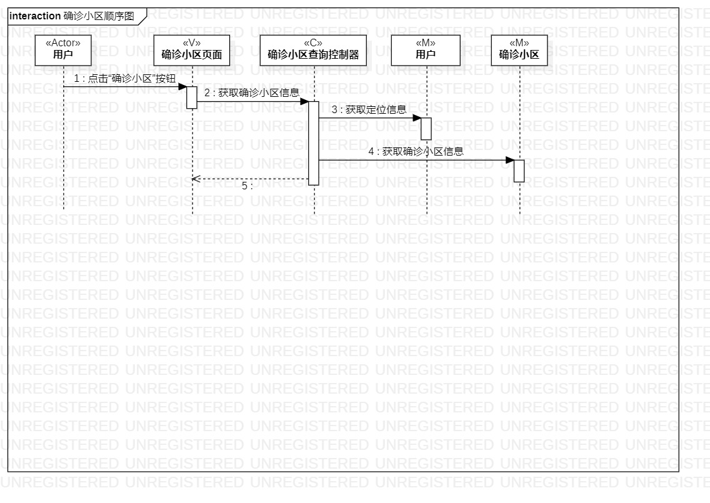
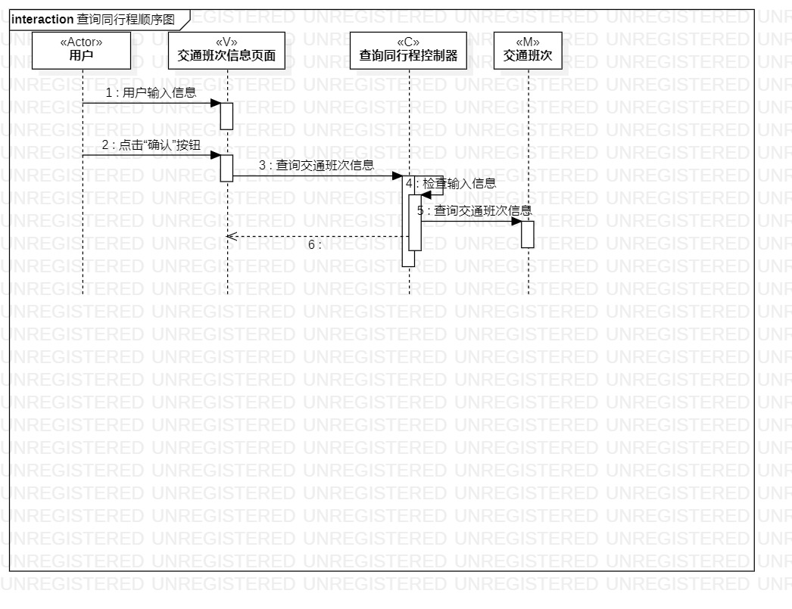
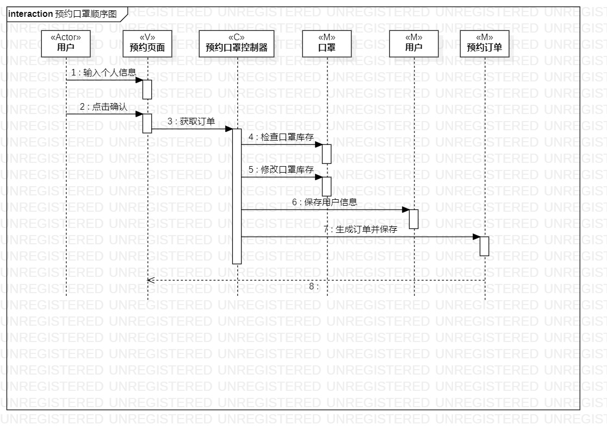

# 实验六：交互建模

## 1.实验目标
1. 理解系统交互；
2. 掌握UML顺序图的画法；
3. 掌握对象交互的定义与建模方法。

## 2. 实验内容
1. 根据用例模型和类模型，确定功能所涉及的系统对象；
2. 在顺序图上画出参与者（对象）；
3. 在顺序图上画出消息（交互）；

## 3. 实验步骤
1. 根据类图确定顺序图中的对象
2. 根据活动图确定顺序图中的交互
3. 画图并完善
4. 对之前的类图、活动图和用例规约进行修改，保持一致。

## 4. 实验结果

  
图1：查询确诊小区的活动图

  
图2：查询同行程的顺序图

  
图3：预约口罩的顺序图
