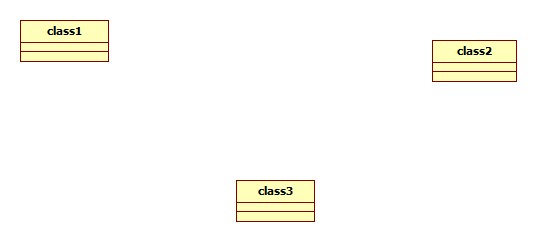

# 实验一

## 一、实验目标

1. 熟悉GitHub实验过程
2. 安装与使用StarUML

## 二、实验内容

- 使用git bash提交实验
- 安装StarUML并创建一个图
- 运用Markdown将图显示在lab1.md文档里面

## 三、实验步骤

1. 注册账号
2. fork复制，git clone到本地磁盘
3. 在SatrUML创建一个图用
4. 用git hub提交实验
5. 在第二个副本上编辑lab1.md文档 

## 四、实验结果

1. 画图

图1. 在StarUML上创建的第一个图
