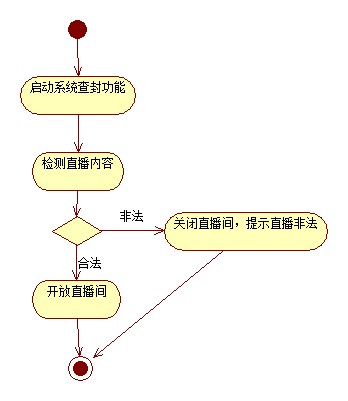
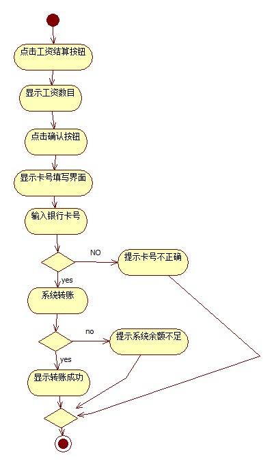

# 实验三：过程建模

 ## 一. 实验目标

 - 掌握过程建模方法
- 掌握活动图的画法

 ## 二. 实验内容

 - 利用StarUML画出活动图
- 熟悉活动图符号的用法和意义
- 编写实验报告

 ## 三. 实验步骤

 1.观看教学视频学习StarUML

 2.打开自己实验二的实验报告查看用例规约

 3.根据录入图片信息用例规约画出用例的活动图

 4.根据修改图片信息用例规约画出用例的活动图

 5.根据购买图片用例规约画出用例的活动图

 6.编写实验报告

 ## 四. 实验结果

 

 图1：查封主播直播间的活动图

 

 图2：结算主播工资的活动图