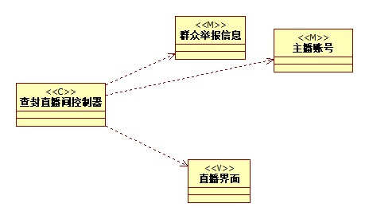
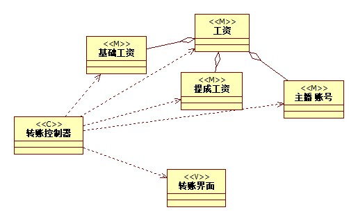

 # 实验四：类建模
 # 实验五：高级类建模

 ## 一.实验目标
- 掌握类建模方法；
- 了解MVC或你熟悉的设计模式；
- 掌握类图的画法；
- 理解类的5种关系；
- 掌握类之间的画法。

 ## 二.实验步骤
- 根据用例规约找出数据，作为模型类
- 系统的动作，作为视图类
- 用例名称，作为控制类

 ## 三.画图要点
- 从用例规约中的基本流程和扩展流程中寻找类；
- 给系统操作设计业务服务类；
- 有多少个用例，画多少个类图。

 ## 四.实验结果

 图1：查封主播直播间类图

 

 图2：结算主播工资类图
