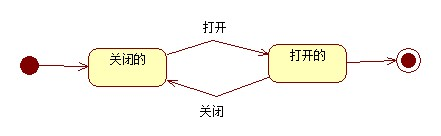
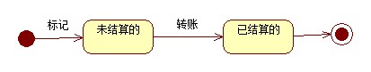

 # 实验七：状态建模

 ## 一、实验目标

 1. 掌握对象状态建模（Statechart）

 ## 二、实验内容

 1. 根据用例图、活动图、类图、时序图来绘画状态图;

 2. 编写实验报告文档。

 ## 三、实验步骤

 1. 选取对象
   - 根据以往的图选取合适的对象.
   - 所选的对象要存在于现实、也要能存在计算机中.
  
 2. 通过给对象加上属性来表达状态（使用形容词来表示状态）.
 3. 找出状态之间的转变条件.
 4. 在StartUML上作状态图.
 ## 四、实验结果

 
​										
 图1:直播间的状态图
 
 
 
 图2:工资的状态图