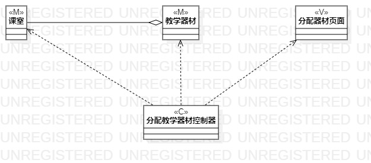
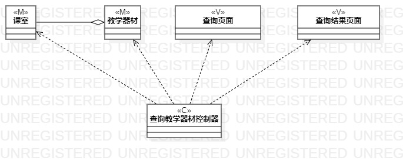

# 实验四:类建模
# 实验五:高级类建模

## 一、实验目标
- 掌握类的概念和构成
- 掌握类建模方法
- 了解MVC设计模式
- 理解类的5种关系
- 掌握类之间关系的画法
## 二、实验内容
- 根据用例规约绘制相应的类图。

   1.新增教学器材类图

   2.课室分配教学器材类图

   3.查询教学器材类图
## 三、实验步骤
- 在StarUML中创建类图
  1.新增器材信息
  2.分配教学信息
  3.查询器材信息
- 从用例规约中的基本流程和扩展流程中寻找类
- 根据系统操作设计业务服务类
- 根据MVC设计模式确定类的关系
## 四、实验结果

图1 新增教学器材类图

图2 课室分配教学器材类图

图3 查询教学器材类图
