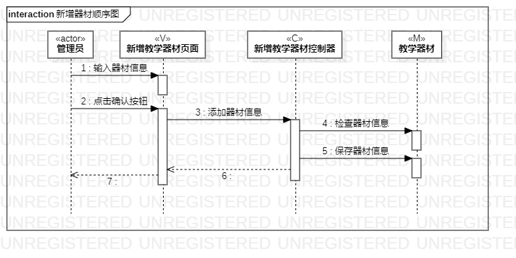
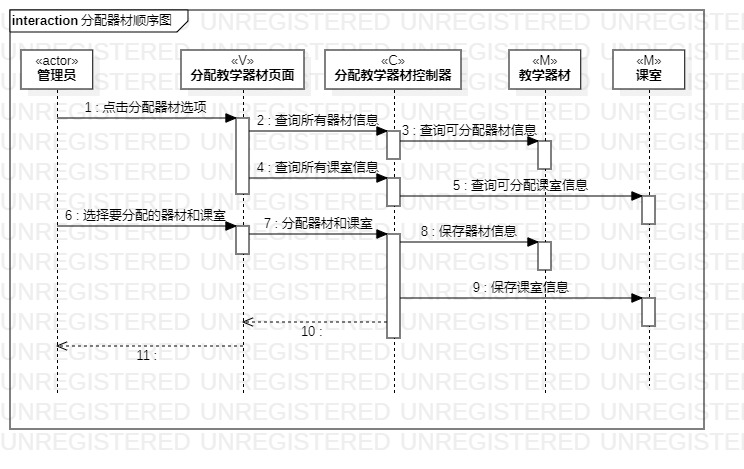
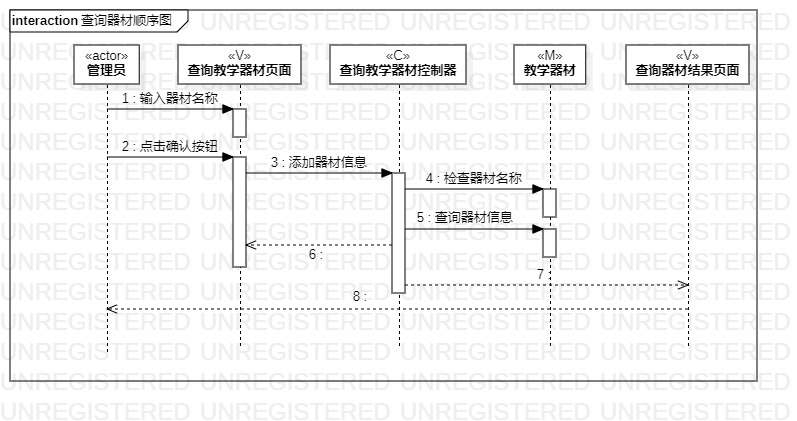

# 实验六：交互建模

## 1.实验目标

1. 理解系统交互；
2. 掌握UML顺序图的画法；
3. 掌握对象交互的定义与建模方法。

## 2.实验内容

1. 根据用例模型和类模型，确定功能所涉及的系统对象。  
2. 在顺序图上画出参与者。  
3. 在顺序图上画出消息。 

## 3.实验步骤

1. 学习了解顺序图中各种符号的用法;  
2. 在StarUML画顺序图  
3. 根据实验二中的用例规约创建三张顺序图（新增器材顺序图、分配器材顺序图、查询器材顺序图）;  
4. 根据实验五、六类建模和高级类建模创建顺序图中的角色actor、界面view、控制器control、还有类model。  
5. 编写实验报告并提交;  

## 4.实验结果

  

                                     图1：新增教学器材顺序图

  

                                     图2：分配教学器材顺序图

   

                                     图3：查询教学器材顺序图
