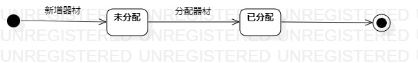

# 实验七：状态建模

## 一、实验目标

1. 掌握对象状态建模；

2. 掌握UML状态图的画法；

3. 掌握对象状态的定义与建模方法。 

## 二、实验内容

1. 根据用例规约、类图、状态图、顺序图来画关键对象的状态图；

2. 设计该对象的关键状态；

3. 设计状态之间的转变条件。

## 三、实验步骤

1. 找出关键的对象；
   - 器材、课室
   
2. 设计该对象的关键状态；
   - 未分配的
   - 已分配的
   
3. 设计状态之间的转变条件；

4. 用StarUML画出该对象的状态图；

5. 建立各个参与者之间的变换关系。

## 四、实验结果

  
                                     图1：器材状态图

  
                                     图2：课室状态图
