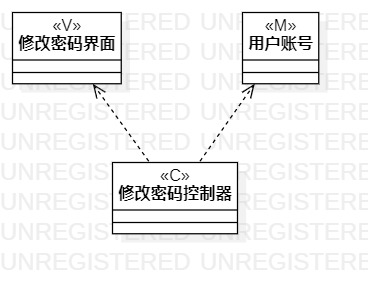

# 实验四、五：类建模与高级类建模

## 一、实验目标

1. 掌握类建模方法；

2. 了解MVC设计模式；

3. 掌握类的五种关系；

4. 掌握类图的画法。

## 二、实验内容

1. 基于MVC模式设计类；

2. 设计类的关系；

3. 画出类图。

## 三、实验步骤

1. 根据用例规约中的基本流程和扩展流程中寻找类：

2. 根据“修改密码”用例，设计以下类：

 * Model：用户账户；

 * View：修改密码界面；

 * Control：修改密码控制器。
 
3. 根据“查询上网记录”用例，设计以下类：

 * Model：用户账户；

 * Model:  上网记录；

 * View：查询上网记录界面；  

 * Control：查询上网记录控制器。  

4. 根据MVC模式分别创建他们之间的依赖关系和包含关系

5. 完成类图的设计、编写实验报告并提交。

## 四、实验结果

  
图1：修改用户密码类图

  
图2：查询上网记录类图
