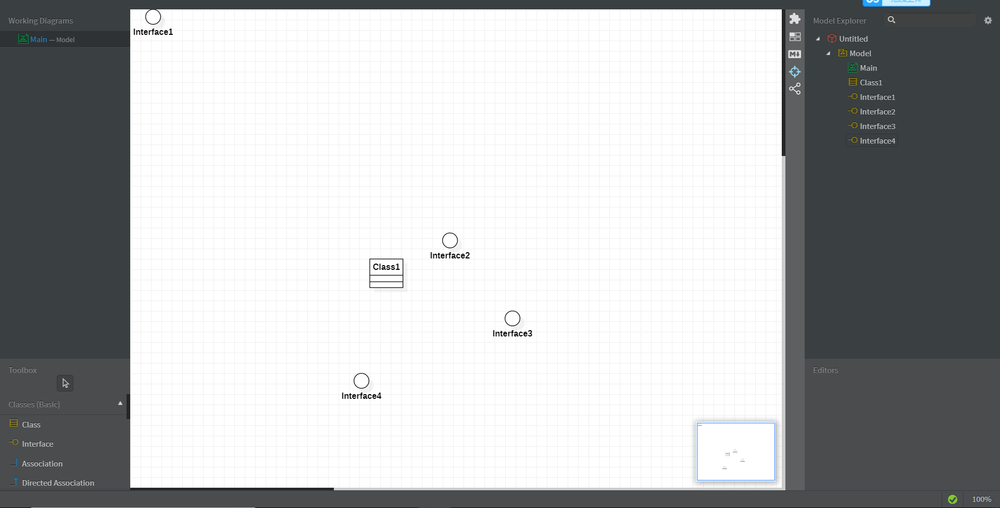

# 实验一

## 实验目标

（1）安装好软件Git和StarUML；
（2）学会（复习）如何在GitHub上做实验；
（3）创建第一个UML图，然后提交到GitHub上。

## 实验内容
  1.fork项目
  2.克隆项目到本地（git clone）
  3.在本地创建文件夹及文件
  4.将文件提交到Github（git add,commit,push）
  5.发送结果到主项目库（pull request）

## 实验结果

