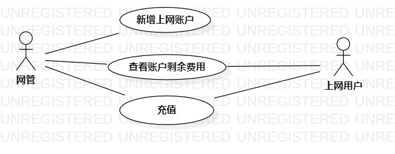

# 实验二 用例建模

## 一、实验目标

1. 学会使用Markdown编写实验报告  
2. 掌握用例的概念和用例建模

## 二、实验内容
1. 提交个人选题到Issues  
2. 用Markdown完成实验报告  
3. 用StartUML完成用例建模  
  

## 三、实验步骤  
1. 在issues上提交“网吧用户管理系统”选题与相关功能：  
- 新增新用户    
- 查询上网记录    
- 修改用户密码    
2. 根据选题和所选功能在StarUML上画出用例图：    
- 创建“网管”和“用户”两个参与者     
- 创建三个用例    
- 建立关系Association    
3. 编写用例规约        
4. 将用例图和实验报告提交    

## 四、实验结果

  
图一：“网吧用户管理系统”用例图

## 表1：创建新用户用例规约  

用例编号  | UC01 | 备注  
-|:-|-  
用例名称  | 新增新用户  |   
前置条件  |     | *可选*   
后置条件  |      | *可选*   
基本流程  | 1.网管点击新增按钮；  |*用例执行成功的步骤*    
~| 2.系统显示新增用户页面；  |   
~| 3.网管输入用户名和密码，点击确认按钮；  |   
~| 4.系统查询新用户信息，检查用户名不存在，保存新用户信息；  |   
~| 5.系统显示用户信息页面。  |  
扩展流程  | 4.1系统查询用户名已存在，提示“用户名已存在”。 |*用例执行失败* 

## 表2：修改用户密码用例规约  

用例编号  | UC02 | 备注  
-|:-|-  
用例名称  | 修改用户密码  |   
前置条件  | 	用户进入个人用户界面     | *可选*   
后置条件  |      | *可选*   
基本流程  | 1. 用户点击修改密码按钮；  |*用例执行成功的步骤*    
~| 2. 系统显示密码修改界面；  |   
~| 3. 用户输入新密码和确认密码，点击修改按钮；   |   
~| 4. 系统检查新密码和确认密码相匹配；   |  
~| 5. 系统检查新密码和旧密码不匹配； |  
~| 6. 系统将旧密码修改为新密码； |
扩展流程  | 4.1 系统检查新密码和确认密码不匹配；|*用例执行失败* 
~| 4.2 系统显示“新密码与确认密码不同”；|*用例执行失败* 
~| 5.1 系统检查新密码与旧密码匹配，提示“新密码不能与旧密码相同”   |  

## 表3：查询上网记录用例规约  

用例编号  | UC03 | 备注  
-|:-|-  
用例名称  | 查询上网记录  |   
前置条件  |  用户进入个人用户界面  | *可选*   
后置条件  |      | *可选*   
基本流程  | 1.用户点击查询按钮；  |*用例执行成功的步骤*    
~| 2.系统显示上网记录查询页面；  |   
~| 3.用户选择起始日期和结束日期，点击确定按钮；   |   
~| 4.系统检查到起始日期在结束日期之前；   |  
~| 5.系统查询并在当前页面下列出相应时间段的上网记录；   |   
扩展流程  | 4.1系统检查到起始日期在结束日期之后；  |*用例执行失败*
~| 4.1系统显示“结束日期不能在起始日期之前，请重新输入”。  |
