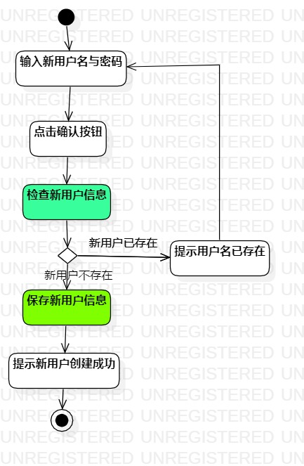
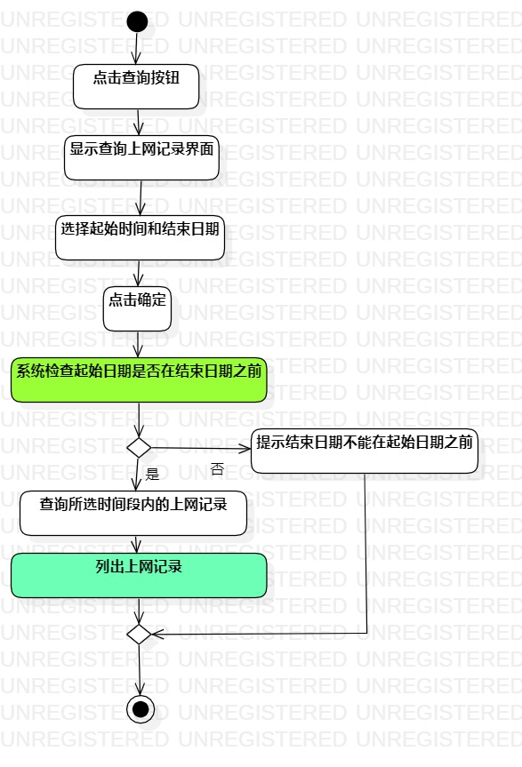

# 实验三：过程建模

## 一、实验目标

1. 掌握过程建模方法

2. 掌握活动图的画法（Activity Diagram)

## 二、实验内容

1. 根据实验二中的用例规约用Start UML创建活动图

2. 用Markdown完成实验报告

## 三、实验步骤

1. 在StartUML里分别新建两个Activity Diagram：

 * Lab3_ActivityDiagram1

 * Lab3_ActivityDiagram2

2. 分别在三个活动图中添加相应的活动：

 * Initial和Final

 * 按基本流程和扩展流程添加操作（Action）

 * 添加相应的决策（Decision）

 * 建立相应的控制流（Control Flow）

3. 适当修改完善用例规约

4. 完成实验报告

## 四、实验结果

  
图1：修改账户密码活动图

  
图2：查询上网记录活动图

