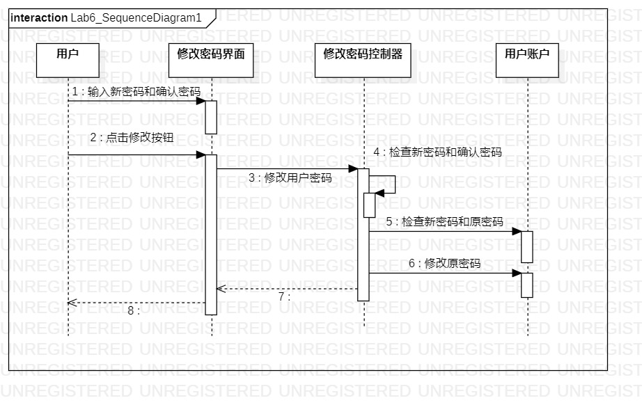
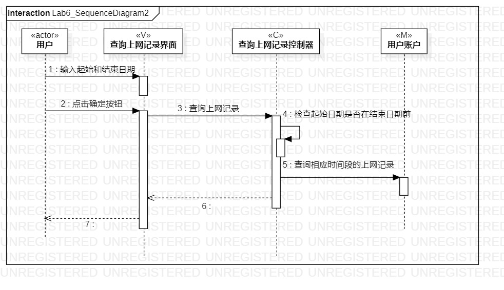

# 实验六：交互建模

## 一、实验目标

1. 理解系统交互

2. 掌握UML顺序图的画法

3. 掌握对象交互的定义与建模方法

## 二、实验内容

1. 根据用例模型和类模型，确定功能所涉及的系统对象

2. 在顺序图上画出参与者（对象）

3. 在顺序图上画出消息（交互）

## 三、实验步骤

1.  创建“修改用户密码”的顺序图
2.  根据类图创建（3+1）参与者：
* 用户（actor)  
* 用户账户（M） 
* 修改密码界面（V）  
* 修改密码控制器（C） 
3.  根据活动图找出操作流程

4.  创建“查询上网记录”的顺序图

5.  根据类图创建（4+1）参与者：  
* 用户（actor)  
* 用户账户（M）
* 上网记录（M） 
* 查询上网记录界面（V）   
*  查询上网记录控制器（C）   

6.  然后同样根据活动图找出操作流程，在顺序图画出参与者之间的联系

7. 修改完善前几次实验

## 实验结果

  
图1：修改用户密码顺序图

  
图2：查询上网记录的顺序图
