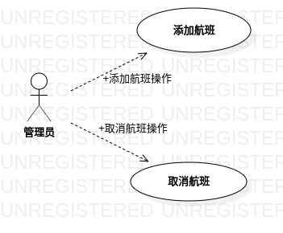

# 实验二：用例建模  

## 一、实验目标

#### 1. 掌握StarUML用例建模；  
#### 2. 确定并细化选题；  
#### 3. 熟悉Markdown语法。

## 二、实验内容  

#### 1. 阅读学习资料，观看录制视频，做好笔记 ；  
#### 2. 提交并确定选题；  
#### 3. 创建用例图并绘制用例规约。  

## 三、 实验步骤

#### 1. 学习笔记：  
- 模型与图：  
（1）UML建模是指将系统描述为模型，UML图是理解模型的窗口或手段；  
（2）我们可以在图中修改模型元素，但是图本身不是模型，而只是表示图形中部分信息的手段。  
- 功能需求与非功能需求：  
（1）用例只规定了系统的功能需求；  
（2）用例不能规定系统的非功能需求（性能、编程语言、平台选择等）。  
- 用例：  
（1）用例源于用户需求；  
（2）用例必须有清晰的通过/失败的条件；  
（3）所有的角色都需要用例。
#### 2. 选题：  
题目：飞机订票管理系统  
功能：  
（1）添加航班：  
由于在节假日人流量较平日更大，管理员会添加更多的航班，以满足客户需求并提高公司盈利，客户订票就能查到比平日更多的票了。    
（2）取消航班：  
由于飞机故障、重大卫生事故或人流量回降，管理员需要通过取消航班限制人流，以保障乘客安全与降低公司亏损，客户订票受限。  
#### 3. 创建用例图
（1）打开StarUML；  
（2）在Model Explore下：右键model -> Add Diagram -> Use Case Diagram；  
（3）在ToolBox的UseCase下：  
-> Actor(Rename "管理员")；  
-> Use Case(Rename "添加航班")；  
-> Use Case(Rename "取消航班")；  
-> Dependency(Rename "添加航班操作", Join "管理员" To "添加航班")；  
-> Dependency(Rename "取消航班操作", Join "管理员" To "取消航班")。  
#### 4. 绘制用例规约 
##### 表1：添加航班用例规约
用例编号  | UC01 | 备注  
-|:-|-  
用例名称  |  添加航班 |   
前置条件  |  管理员已在航班添加的操作页面   | *可选*   
后置条件  |     | *可选*   
基本流程  | 1. 管理员输入添加的航班；| *用例执行成功的步骤*
~| 2. 管理员点击确认按钮； |
~| 3. 系统检查航班时间可兼容;  |
~| 4. 系统检查对应类型航班有闲置;  |
~| 5. 系统保存添加信息；  |
~| 6. 系统显示航班添加成功的页面。 |
扩展流程  | 3.1 系统检查航班时间不可兼容，提示“航班时间冲突，添加失败”，返回航班添加的操作页面；  |*用例执行失败的步骤*
~| 4.1 系统检查对应类型航班无闲置，提示“航班忙碌，添加失败”，返回航班添加的操作页面。 |
##### 表2：取消航班用例规约
用例编号  | UC02 | 备注  
-|:-|-  
用例名称  |  取消航班 |   
前置条件  |  管理员已在可取消的航班的信息页面   | *可选*   
后置条件  |     | *可选*   
基本流程  | 1. 管理员编辑航班；|*用例执行成功的步骤* 
~| 2. 管理员点击确认按钮；  |
~| 3. 系统检测到所选航班可取消；  |
~| 4. 系统显示所选航班正在取消的页面；  | 
~| 5. 系统保存取消信息；  |
~| 6. 系统修改客户订单；  |
~| 7. 系统触发对应客户的退款业务；  |
~| 8. 系统发送致歉信息给对应客户；  |
~| 9. 系统显示航班取消成功的页面。  |
扩展流程  | 3.1 系统重新检测到所选航班不可取消，显示航班取消失败的页面。 |*用例执行失败的步骤* 

## 四、 实验结果  
#### 图1：用例图


## 五、实验总结
1. 养成良好的表达习惯，有助于锻炼思维，可以通过写作提高；
2. 要经常使用git pull 和 git push；
3. 依赖关系是弱的关联关系，用带箭头的虚线表示，这种使用关系是具有偶然性的、临时性的、非常弱的；
4. 用例规约中，基本流程和拓展流程的每一个step，是活动（动态的）而非状态（静态的），这一点要明确；
5. 用例建模是整个UML建模的核心及基础：  
（1）核心：需求分析是软件系统开发的核心：解决需求，可行性判定；  
（2）基础：后续模型要以用例模型为基础：用例图（参与者、用例），用例规约（基本流程、拓展流程）。  
## 六、实验调试

1. 
what:  
步骤描述不简洁，拖泥带水的。  
why:  
平常说话比较随意，使用补充的说辞，常出现主次不分，重点不明的尴尬场景。  
how:  
- 要把握功能性需求的描述方法：主语+谓语+宾语。
- 多用简单句或者并列句。
- 养成写作的习惯。
  
2.  
what:  
用例规约的用例名称与模型图中的用例名称不一致导致混乱。  
why:  
未能把握用例规约的作用：用例规约就是对模型图的一种过程说明详述。  
how:  
改动比较方便改的那一处即可（用例规约的地方）。  

3.   
what:  
git pull时发生如下错误：  
error: failed to push some refs to 'https://www.github.com/cyh1069247088/uml-modeling-2020.git'  
why:  
个人库并非本地库的母集。  
how：  
``` bash
git pull --rebase origin master
```
注：本地库操作前养成git pull的习惯。  


