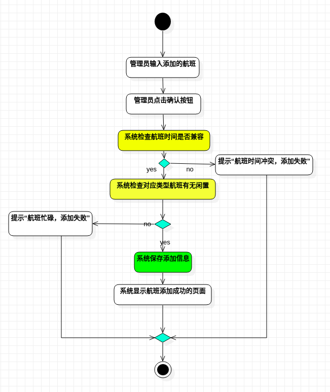
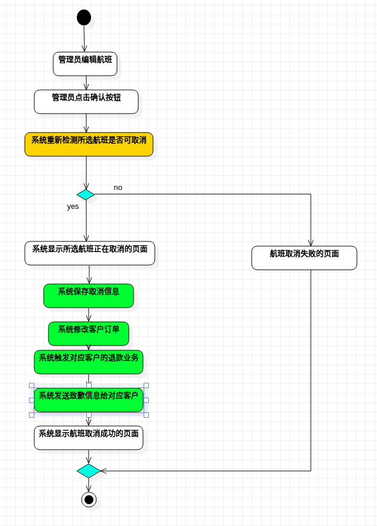

# 实验名称：过程建模
## 一、实验目标
#### 1. 掌握过程建模的方法；
#### 2. 掌握活动图的画法。
## 二、实验内容
#### 1. 记过程建模学习笔记；
#### 2. 画活动图。
## 三、实验步骤
#### 1. 观看录制视频、琢磨课堂文档：

（1）学习来源：  
- [bilibili实验3的录播课程集](https://b23.tv/av96420419/p1)  
- [实验3内容及讲义](https://github.com/hzuapps/uml-modeling-2020/issues/3)

（2）学习笔记：  
- 初始结点：是虚拟的，用实心圆表示，表示活动的开始  
- 结束结点：是虚拟的，用实心加圆圈表示，表示活动的结束  
- 流程线：用带箭头的实线表示，表示顺序执行活动  
- 决策：用菱形表示，表示分不同情况执行，并且从决策出去的带箭头的实线要标注活动执行的条件；推荐成对使用菱形表示决策  
- 活动：用圆角的矩形表示，表示操作步骤  

#### 2. 活动图制作步骤如下：

（1）创建Activity Diagram  
（2）添加初始结点、添加结束结点  
（3）添加活动、分支处添加决策  
（4）添加流程线、调整整体  

## 四、实验结果

#### 1. 活动图1：添加航班
  
#### 2. 活动图2：取消航班
  

## 五、实验总结

#### 1. 过程建模的方法如下：
- 依据用例规约的基本流程和拓展流程，实现过程建模
#### 2. 活动图画法如下（画法顺序不唯一）：
- 创建Activity Diagra -> 添加初始结点、添加结束结点 -> 添加活动、分支处添加决策 -> 添加流程线、调整整体
#### 3. 决策前应有类似检查的动作，检查后要有条件表明分支（yes/no、true/false或文字描述，与检查的动作相匹配），条件过后系统要有对应的动作保存信息（lab2.md提及），再之后就要动作有反馈（增加友好性）
## 六、实验调试
#### Q1:
what:  
决策错误地使用粗直线而非菱形表示  
why:  
粗直线表示的是可并发，多线程的；菱形表示的是多种情况的决策  
how:  
用成对的菱形替换掉粗直线  
#### Q2:
what:  
删除本地库的model1.jpg和model2.jpg之后，push操作不能实现github个人帐号下的修改  
why:  
git本读磁盘分为暂存区和工作区，push是将暂存区推到个人帐号的；而平常操作的是工作区，这就需要类似于add或者rm操作，将工作区指定文件保存起来了  
how：  
``` bash
git rm -f model1.jpg model2.jpg #remove from stage
git commit -m "delete model1.jpg and model2.jpg"
git push
```
#### Q3:  
what：  
为方便老师查看有可能需要反复修改的图片，需要学会在pull request的commit中显示图片，但是不知道如何读取图片的路径  
why：  
事实上，当用户pull request后，文档路径会在** https://raw.githubusercontent.com/用户帐号名/主库名/master ** 下  
how：   
```


```
#### Q4:
what:  
流程线一直画不直，导致看起来歪歪扭扭的，通过调整活动图位置也无济于事  
why:  
如果只是调整活动图位置，由于两个相邻活动图的相邻边的长度奇偶性不同，而线只在活动图的中间，每次移动以一个单元为单位，所以通过移动活动图永远无法对齐  
how:  
加之通过调节活动图的长度即可  
