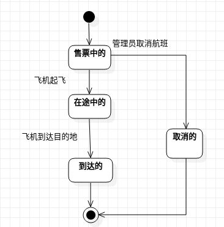
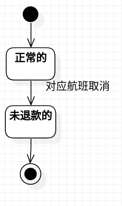

# 实验7名称：状态建模

## 一、实验目标

#### 1. 掌握对象状态建模（状态图，Statechart）。
#### 2. 整理之前的实验，避免前后矛盾。

## 二、实验内容

#### 1. 记录学习过程；
#### 2. 确定核心要素；
#### 3. 画状态图。

## 三、实验步骤

#### 1. 观看录制视频、学习课堂文档：

1.1 学习来源：
- [b站资料](https://space.bilibili.com/44472532/)的实验7部分
- [实验7内容及讲义](https://github.com/hzuapps/uml-modeling-2020/issues/7)

1.2 学习笔记：

1.2.1 概念讲解：

(1). 对象的状态：
- 找关键（最重要的）对象进行建模（不能拘泥于你选择的功能）。
- 对象的状态取决于对象所包含的所有数据。
- 状态是指条件在某一特定时间的存在。可以是主动的状态，也可以是被动的状态。

(2). 状态图及其画法：
- 状态图还是属于逻辑视图。
- 状态（节点）、事务（转变条件）和箭头直线（转变方向）组成。
- 第一，找到对象；第二，找到该对象的所有状态；第三，找到状态转换的事务。
- 初始状态，结束状态（都是虚拟的）。

(3). 事务：
- 原始状态到目标状态转变的条件。

1.2.2 实验要求

- 实验目标：掌握对象状态建模（状态图，Statechart）。

1.2.3 状态图画图演示：根据用例图、用例规约、活动图、类图、顺序图来画图：

(1). 寻找1个重要的对象：
- 不拘泥于你所选择的功能，选择所建模软件系统中最终要的对象。

(2). 寻找这个对象的所有重要状态：
- 状态命名：形容词。
- 注意合并相同的状态：数据的值明显相同的。
- 注意有些状态在系统中是没有存在的。

(3). 写出状态之间的转变触发方式，注意方向。

1.2.4 常见问题：
- 区分转变的签名与转变的条件：转变的签名是一个动作，转变的条件是动作结果的一种情况。
- “不存在”的状态是指：在系统中没有这样的状态了的。“相同”的状态是指：属性的数据完全相同。
- 搞清楚状态图画的是什么：操作也有状态，但不重要；要画的是重要对象（Model）的状态图。

#### 2. 确定核心要素

2.1 确定几个重要的对象：
- 航班。（理由：两个用例规约都出现了航班，本次issue也是航班状态的转换，即取消和添加。）
- 订单。（理由：取消航班之后会出现订单的相关业务，对应订单状态的变化。）

2.2 确定对象的所有重要状态：
- 闲置的、售票中的、在途中的、到达的和取消的航班。
- 待付款的、已付款的、已出票的、待取消的和已退款的订单。

2.3 确定对象的状态之间的关键转变的签名：
- 通过管理员添加航班的，闲置的航班转变为售票中的；通过管理员取消航班，售票中的航班转变为预取消的。
- 通过客户退票或管理员取消对应航班，已付款的订单转变为待取消的；通过管理员取消对应航班，已出票的订票转变为待取消的；通过系统触发退款业务，待取消的订单转变为已退票的。

## 四、实验结果

#### 1. 航班状态图

#### 2. 订单状态图

## 五、实验总结
- 对象状态建模步骤：寻找1个重要的对象，寻找这个对象的所有重要状态，写出状态之间的转变触发方式。
- 对于实验检查有新的理解，可以先修改后面的，然后再此基础上往前修改，但是每个实验要记录好要点，修改的时候不至于破坏原本的正确的地方。
