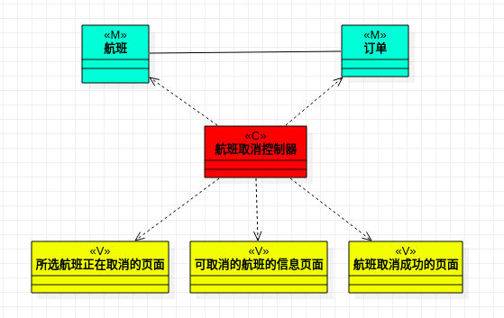
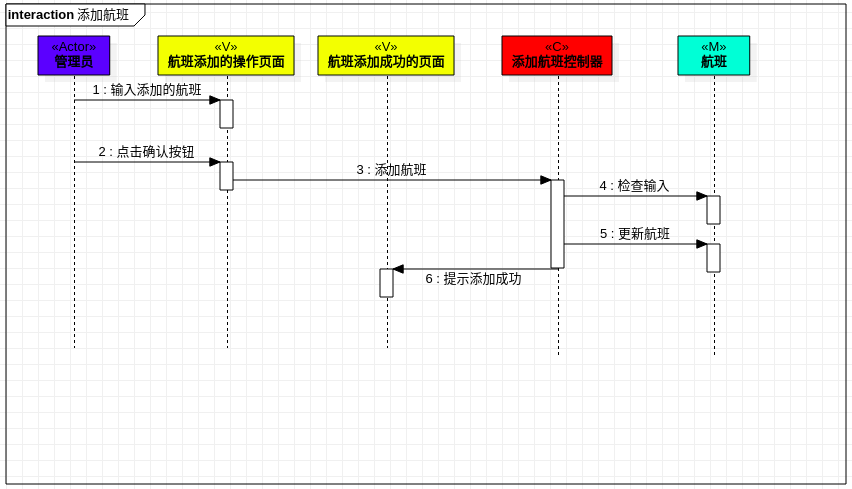
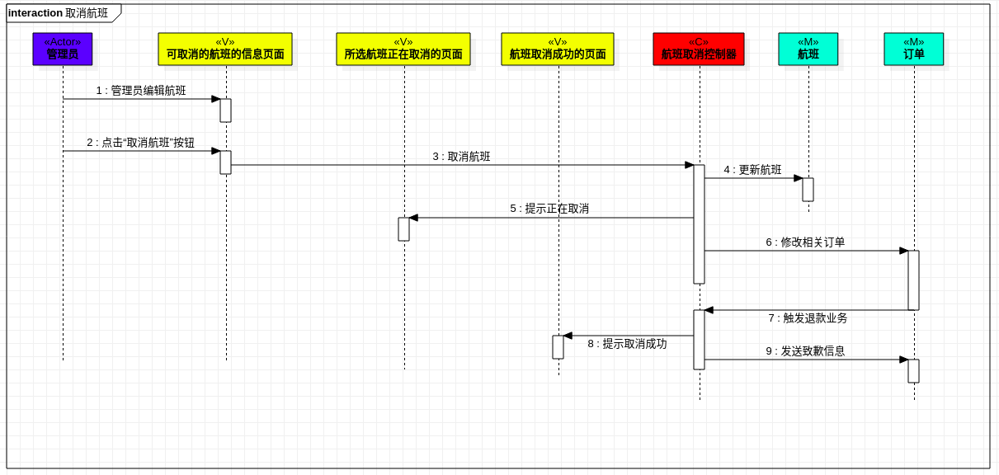
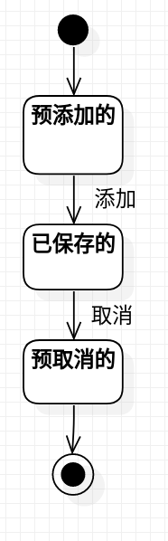

# 实验8名称：综合实验

## 一、实验目标
- 掌握基于UML 2.0的建模概念与方法，掌握各种UML图的概念与画法，其中包括用例图、活动图、类图、顺序图、组件图和状态图等。

## 二、实验设备与环境
- 操作系统：Ubuntu16.04LTS；建模工具：StarUML。

## 三、实验要求

#### 1. 实验及实验报告以增量方式完成，每次作业都在上一次作业的基础上完成；

#### 2. 请将实验报告中“占位符”信息替换为自己的实验相关信息；

#### 3. 请认真撰写实验体会，按『教学助理』微信小程序要求发送作业。

## 四、实验内容、程序清单及运行结果

- 功能：添加航班，取消航班。
- 添加航班：由于在节假日人流量较平日更大，管理员会添加更多的航班，以满足客户需求并提高公司盈利，客户订票就能查到比平日更多的票了。
- 取消航班：由于飞机故障、重大卫生事故或人流量回降，管理员需要通过取消航班限制人流，以保障乘客安全与降低公司亏损，客户订票受限。

#### 1. 实验一：需求建模 - 用例模型

- 表1：添加航班用例规约  

用例编号  | UC01 | 备注  
-|:-|-  
用例名称  |  添加航班 |   
前置条件  |  管理员已在航班添加的操作页面   | *可选*   
后置条件  |     | *可选*   
基本流程  | 1. 管理员输入添加的航班；| *用例执行成功的步骤*
~| 2. 管理员点击确认按钮； |
~| 3. 系统检查航班时间可兼容;  |
~| 4. 系统检查对应类型航班有闲置;  |
~| 5. 系统保存添加信息；  |
~| 6. 系统显示航班添加成功的页面。 |
扩展流程  | 3.1 系统检查航班时间不可兼容，提示“航班时间冲突，添加失败”，返回航班添加的操作页面；  |*用例执行失败的步骤*
~| 4.1 系统检查对应类型航班无闲置，提示“航班忙碌，添加失败”，返回航班添加的操作页面。 |

- 表2：取消航班用例规约  

用例编号  | UC02 | 备注  
-|:-|-  
用例名称  |  取消航班 |   
前置条件  |  管理员已在可取消的航班的信息页面   | *可选*   
后置条件  |     | *可选*   
基本流程  | 1. 管理员编辑航班；|*用例执行成功的步骤* 
~| 2. 管理员点击确认按钮；  |
~| 3. 系统检测到所选航班可取消；  |
~| 4. 系统显示所选航班正在取消的页面；  | 
~| 5. 系统保存取消信息；  |
~| 6. 系统修改客户订单；  |
~| 7. 系统触发对应客户的退款业务；  |
~| 8. 系统发送致歉信息给对应客户；  |
~| 9. 系统显示航班取消成功的页面。  |
扩展流程  | 3.1 系统重新检测到所选航班不可取消，显示航班取消失败的页面。 |*用例执行失败的步骤* 

#### 2. 实验二：过程建模 – 活动模型
- 使用活动图描述系统的业务过程。
- 方法：将用例规约中的基本流程与扩展流程抽象为过程步骤（Action），画出对应的活动图。
- 活动图1：

- 活动图2：

#### 3. 实验三：逻辑建模 – 类模型
- 基于MVC设计模式找出实现用例的类。
- 方法：分别找出实现用例的模型（Model）、视图（View）和控制器（Controller）类，确定类之间的关系及其关键属性，画出类图。
- 参考：讲义P26页。
- 类图1： 

- 类图2： 

#### 4. 实验四：交互建模 – 顺序模型
- 创建各个类（MVC及Actor）的对象，并描述对象之间的交互。
- 方法：分别创建参与者（Actor）、界面类（View）、控制器类（Controller）和模型类（Model）的对象，描述各个对象之间的消息及其顺序，画出顺序图。
- 参考：讲义P33页8.7.2。
- 顺序图1： 

- 顺序图2： 

#### 5. 实验五：状态建模 – 状态模型
- 对系统中最重要的对象进行状态建模。
- 方法：选择一种对象，定义该对象的状态，描述状态之间的切换及条件，画出状态图。
- 参考：讲义P9和P10页。
- 状态图：

## 五、实验体会

#### 1. 实验一：需求建模 - 用例模型
1.1 养成良好的表达习惯，有助于锻炼思维，可以通过写作提高；
1.2 要经常使用git pull 和 git push；
1.3 依赖关系是弱的关联关系，用带箭头的虚线表示，这种使用关系是具有偶然性的、临时性的、非常弱的；
1.4 用例规约中，基本流程和拓展流程的每一个step，是活动（动态的）而非状态（静态的），这一点要明确；
1.5 用例建模是整个UML建模的核心及基础：  
- 核心：需求分析是软件系统开发的核心：解决需求，可行性判定；  
- 基础：后续模型要以用例模型为基础：用例图（参与者、用例），用例规约（基本流程、拓展流程）。  

#### 2. 实验二：过程建模 – 活动模型
1.1 过程建模的方法如下：
- 依据用例规约的基本流程和拓展流程，实现过程建模
1.2 活动图画法如下（画法顺序不唯一）：
- 创建Activity Diagra -> 添加初始结点、添加结束结点 -> 添加活动、分支处添加决策 -> 添加流程线、调整整体
1.3 决策前应有类似检查的动作，检查后要有条件表明分支（yes/no、true/false或文字描述，与检查的动作相匹配），条件过后系统要有对应的动作保存信息（lab2.md提及），再之后就要动作有反馈（增加友好性）

#### 3. 实验三：逻辑建模 – 类模型
1.1 MVC设计模式是一种软件设计典范，用一种业务逻辑、数据、界面显示分离的方法组织代码，将业务逻辑聚集到一个部件里面，在改进和个性化定制界面及用户交互的同时，不需要重新编写业务逻辑。
1.2 本次类图的画法为： 先根据Model（业务数据）、View（页面）和Controller（功能+控制器）找出具体的类，标注好类型（M/V/C），确定类之间的关系，如果有箭头，注意箭头指向。

#### 4. 实验四：交互建模 – 顺序模型
1.1 实验总是需要迭代修改的，不能期望一次性完成实验，而且要反复检查，才能尽可能避免低级错误。老师若是提到不足的地方，要主动修改，想想有没有类似的错误。
1.2 先找到第一个参与者（一般是系统外的用户），然后根据类图找到N个参与者，（就有1+N个参与者了），最后结合活动图传递消息。注意期间（很）可能需要改进类图和活动图。

#### 5. 实验五：状态建模 – 状态模型
1.1 对象状态建模步骤：寻找1个重要的对象，寻找这个对象的所有重要状态，写出状态之间的转变触发方式。
1.2 对于实验检查有新的理解，可以先修改后面的，然后再此基础上往前修改，但是每个实验要记录好要点，修改的时候不至于破坏原本的正确的地方。

