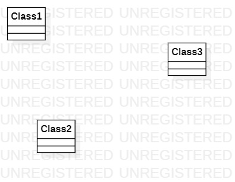

# 实验一: UML建模工具

## 一、实验目标

1. 熟悉Github实验过程
2. 安装和使用StarUML

## 二、实验内容

1. 安装GitHub并练习使用Git Bash
2. 安装StarUML并创建一个图

## 三、实验步骤

1. 登录GitHub账号，找到实验课程库，fork课程项目到我的仓库
2. 使用Git Bash将我仓库里的课程项目git clone到本地
3. cd进students文件夹，mkdir创建学号文件夹，cd进学号文件夹，创建md文档
4. 使用StarUML创建一个图，并导出jpg格式
5. 在md文件里编写实验报告，并引用创建的UML图
6. 将本地修改提交到我的远程仓库
7. 发送结果到主项目库

## 四、实验结果

### 1. 画图

  
图1. 使用StarUML创建的第一个UML图
