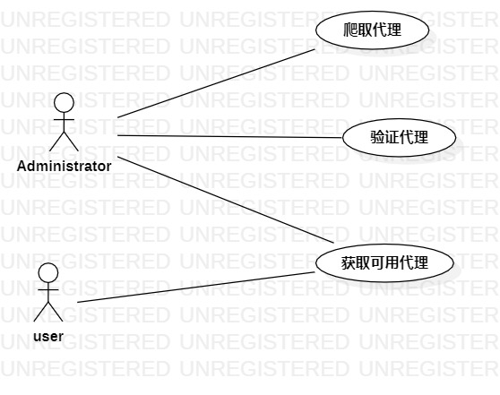

# 实验二: 用例建模

## 一、实验目标

1. 理解UML用例建模的概念
2. 掌握画用例图的方法

## 二、实验内容

1. 选择个人建模选题
2. 根据建模选题画用例图

## 三、实验步骤

1. 在GitHub的issues中发布自己的建模选题

    ```
    选题：#364 ip代理池
    功能：
    1. 从代理网站获取免费代理ip，保存代理ip
    2. 提供有效的代理ip
    ```

2. 找出建模选题中的用例和参与者

    ```
    用例：添加代理、获取代理
    参与者：Administrator、user
    ```

3. 在StarUML中画出用例图，首先画出用例：添加代理、获取代理，接着，画出参与者：Administrator，user，最后将参与者与相关用例用直线连起来

4. 导出用例图，并使用markdown编写实验报告，在实验报告中使用导出的用例图

## 四、实验结果

### 1. 画图

  
图1. ip代理池用例图

## 表1：添加代理用例规约

用例编号  | UC01
-|:-
用例名称  | 添加代理 
前置条件  |         
后置条件  |         
基本流程  | 1.Adminstrator点击添加代理按钮
~| 2.系统返回添加代理页面
~| 3.Adminstrator输入代理网站，点击确定按钮
~| 4.系统检查输入不为空，系统访问代理网站
~| 5.系统访问页面成功，提取代理  
~| 6.系统保存代理 
~| 7.系统提示“添加成功”  
扩展流程  | 4.1 系统检查输入为空，提示“输入为空，重新输入”  ，返回添加页面
~| 5.1 系统访问目标网站出错，提示“访问错误” 

## 表2：获取代理用例规约  

用例编号  | UC02
-|:-
用例名称  | 获取代理  
前置条件  |       
后置条件  |         
基本流程  | 1.Adminstrator或user点击获取按钮      
~| 2.系统返回获取代理页面
~| 3.Adminstrator或user输入获取代理类型，点击确定按钮
~| 4.系统检查输入不为空且存在该代理类型的代理ip，系统查询代理
~| 5.系统查询结果不为空，返回代理 
~| 6.系统提示“获取成功” 
扩展流程  | 4.1  系统检查输入为空，提示“输入为空，重新输入” 
~| 4.2  系统检查代理类型不存在，提示“无该类型代理”
~| 5.1  查询结果为空，提示“无可获取代理”
