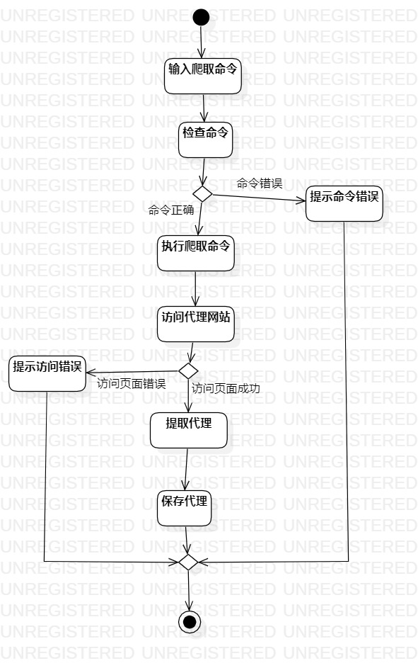
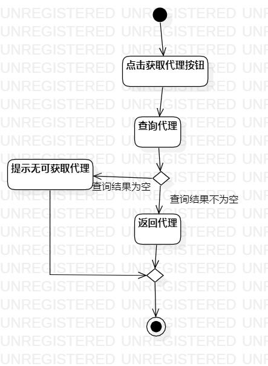

# 实验三: 过程建模

## 一、实验目标

1. 掌握过程建模方法；
2. 掌握活动图的画法。（Activity Diagram）

## 二、实验内容

1.  观看指定的学习视频
2.  根据实验二的用例规约画出活动图

## 三、实验步骤

1.  打开StarUml，创建活动图，命名为添加代理的活动图
2.  添加Initial和Final，表示开始和结束
3.  根据用例规约的流程添加相应的Action，
4.  如果有扩展流程，则添加Decision
5.  最后添加一个Merge将分支汇总
6.  使用Control Flow连接起来，并在Decision添加相应的条件
7.  在画图过程完善用例规约
8.  调整图标的位置使连线不交叉
9.  导出活动图为jpg文件
10.  根据以上步骤，创建出获取代理的活动图

## 四、实验结果

  
图1. 添加代理的活动图

  
图2. 获取代理的活动图
