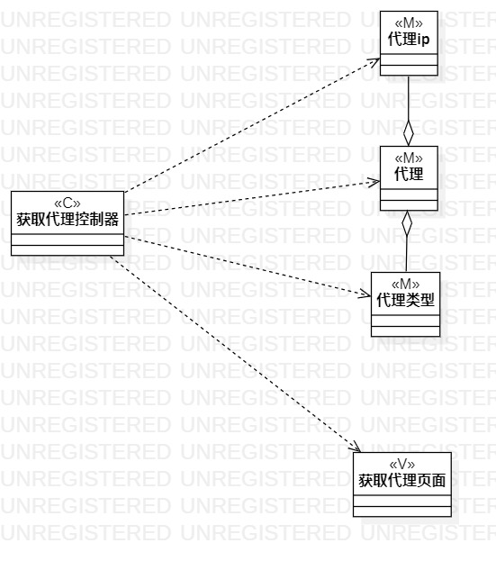

# 实验四五：类建模

## 一、实验目标

1.  掌握类建模方法；
2.  了解MVC或你熟悉的设计模式；
3.  掌握类图的画法。（Class Diagram）
4.  理解类的5种关系
5.  掌握类之间关系的画法

## 二、实验内容

1.  基于MVC模式设计类

2.  设计类的关系

3.  画出类图

## 三、实验步骤

1. 新建类图（Add Diagram -> Class Diagram）
2. 根据实验二的用例规约找出每个用例存在的类，画出各个类
    1.  添加代理用例：添加代理控制器(C)、代理(M)、代理ip(M)、代理类型(M)、添加代理页面(V)
    2.  获取代理用例：获取代理控制器(C)、代理(M)、代理ip(M)、代理类型(M)、获取代理页面(V)
3. 根据MVC模式，将类划分成模型、视图、控制器，并在类图中标识
4. 确定类之间的关系，用相对应的线连接起来，我的类图中主要用到了两种线
    - 依赖Dependency（虚线箭头）
    - 聚合Aggregation（实线空心棱形）

## 四、实验结果

  
图1：添加代理用例的类图

  
图2：获取代理用例的类图

## 五、实验体会

1.  类之间的关系有五种：依赖（虚线箭头）、关联（实线）、聚合（实线空心菱形箭头）、组合（实线实心菱形箭头）、继承（实线空心三角形）
2.  依赖是弱关系，继承是强关系。

3.  MVC设计模式由三部分组成：
    1.  Model：模型、实体、业务数据
    2.  View：视图、界面
    3.  Controller：控制器、系统、Service
