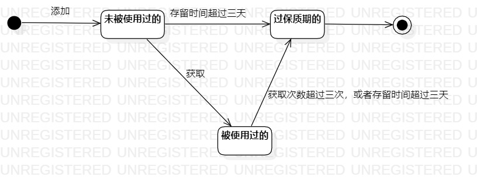

# 实验七：状态建模

## 实验目标

1.  掌握对象状态建模（状态图，Statechart）
2.  学习状态图的画法

## 实验内容

1.  学习对象的状态的概念；
2.  学习状态图的画法；
3.  找出自己系统中的一个关键对象，绘制该对象的状态图。

## 实验步骤

1. 从系统中找出一个关键对象：代理
2. 确定对象的关键状态：
    1. 未被使用过的
    2. 被使用过的
    3. 过保质期的
3. 设计上述状态之间的转变条件；
4. 用StarUML画出该对象的状态图：状态用圆角矩形，转变条件用带箭头实线

## 实验结果

  
图1：代理的状态图

## 实验笔记

状态图步骤：

1.  寻找一个关键的对象

2.  设计该对象的关键状态

    ```
    1.  对象的状态是：对象所表示的数据。如果数据发生变化，状态就是发生变化。
    2.  描述状态：形容词。
    3.  例子：订单： 新的（New）、已付款的、取消的、已发货的、已签收的、退货中的、 完成的。
    ```

3.  设计状态之间的转变条件：整个状态图都是在描述一个对象。 