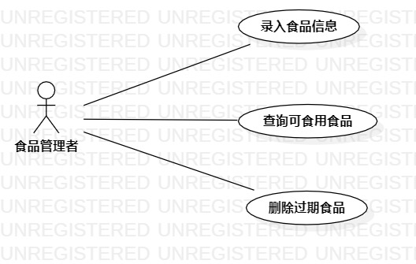

# 实验2
## 一、实验目标
 1.创建并完善选题

 2.了解并掌握用例图的画法

 3.通过github提交实验文档

## 二、实验内容
 1.建立个人选题项目

 2.根据自己的项目运用UMLStar绘制用例图

 3.用git操作提交本次实验
 
## 三、实验步骤
 1.确定系统的功能
 
 - 录入食品信息
 - 删除食品
 
 2.确定系统操作者
 
   - 食品管理者
   
 3.用StartUML画用例图
 
 - 创建食品管理者（Actor）
 - 创建系统的两个功能
   - 录入食品信息
   - 删除食品
 - 建立食品管理者与功能之间的联系
 
 4.编写用例规约
 
 - 录入食品信息用例规约  
 
 - 删除食品用例规约 

## 四、实验结果

  
图1：#417 个人食品管理系统的用例图

## 表1：录入食品信息用例规约  

用例编号 | UC01 | 备注  
-|:-|-  
用例名称  | 录入食品信息 |   
前置条件  | 食品管理者登录成功   | *可选*   
后置条件  |  系统显示食品列表   | *可选*   
基本流程  | 1. 食品管理者点击添加食品按钮；  |*用例执行成功的步骤*    
~| 2. 系统显示添加食品页面  |   
~| 3. 食品管理者输入食品名称、食品数量、食品过期时间，点击添加按钮；  |   
~| 4. 系统检验添加的食品信息完整且过期时间合理，记录食品信息；  |   
~| 5. 系统显示"添加成功"  |  
扩展流程  | 4.1 系统检查发现食品过期时间不合理，提示"食品已过期"；  |*用例执行失败*    
~| 4.2. 系统检查发现添加的食品信息不完整，提示"食品信息不完整" |

## 表2：删除食品用例规约  

用例编号 | UC02 | 备注   
-|:-|-  
用例名称  |  删除食品   |   
前置条件  |  系统显示食品列表且列表中的食品数不为零    | *可选*   
后置条件  | 系统显示已删除食品列表     | *可选*   
基本流程  | 1. 食品管理者点击绑定在该食品上的删除按钮；  |*用例执行成功的步骤*    
~| 2. 系统检查该食品为过期状态或该食品数量为零，移除该食品信息；  |   
~| 3. 系统显示"删除成功" |   
扩展流程  | 4.1 系统检查发现该食品不为过期状态且数量不为零，提示"食品不符合删除条件"；  |*用例执行失败*    

