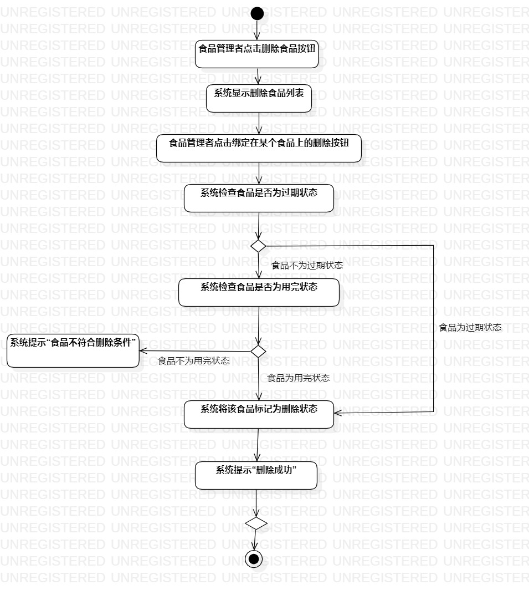

# 实验三： 过程建模

## 1. 实验目标

- 掌握过程建模的方法  

- 掌握活动图的画法  

## 2. 实验内容  

- 画出活动图  

- 编写实验报告  

## 3. 实验步骤

- 打开实验2编写的用例规约  

- 在StarUML中创建录入食品信息活动图  

（1）创建起始节点和结束节点  

（2）根据食品录入信息用例规约，添加活动及决策点  

（3）建立各个节点、决策点和活动的关系  

（4）调整节点大小，使图片美观  

 - 在StarUML中创建删除食品活动图  
 
（1）创建起始节点和结束节点  

（2）根据食品录入信息用例规约，添加活动及决策点  

（3）建立各个节点、决策点和活动的关系  

（4）调整节点大小，使图片美观  

- 编写实验报告 

## 4. 实验结果  

  

图1：录入食品信息活动图  

  

图2：删除食品活动图

 
