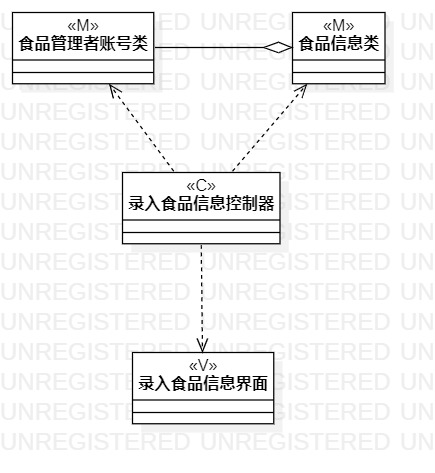
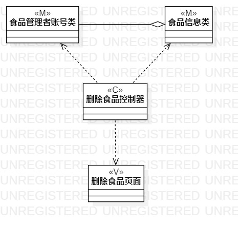

# 实验四：类建模

## 一、实验目标

1. 掌握类建模方法
2. 了解MVC或熟悉的设计模式
3. 掌握类图的画法（Class Diagram）
4. 理解类的5种关系

## 二、实验内容

1. 基于MVC模式设计类
2. 设计类的关系
3. 画出类图

## 三、实验步骤

1. 创建录入食品信息类图
2. 首先根据MVC创建食品信息类、录入食品信息控制器、录入食品信息页面
3. 然后给录入食品信息控制器与食品信息类、录入食品信息页面建立依赖关系
4. 创建删除食品类图
5. 根据MVC创建食品信息类、删除食品控制器、删除食品控制器
6. 然后给删除食品控制器与食品信息类、删除食品控制器建立依赖关系

## 实验结果

  
图1：录入食品信息类图

  
图2：删除食品类图
