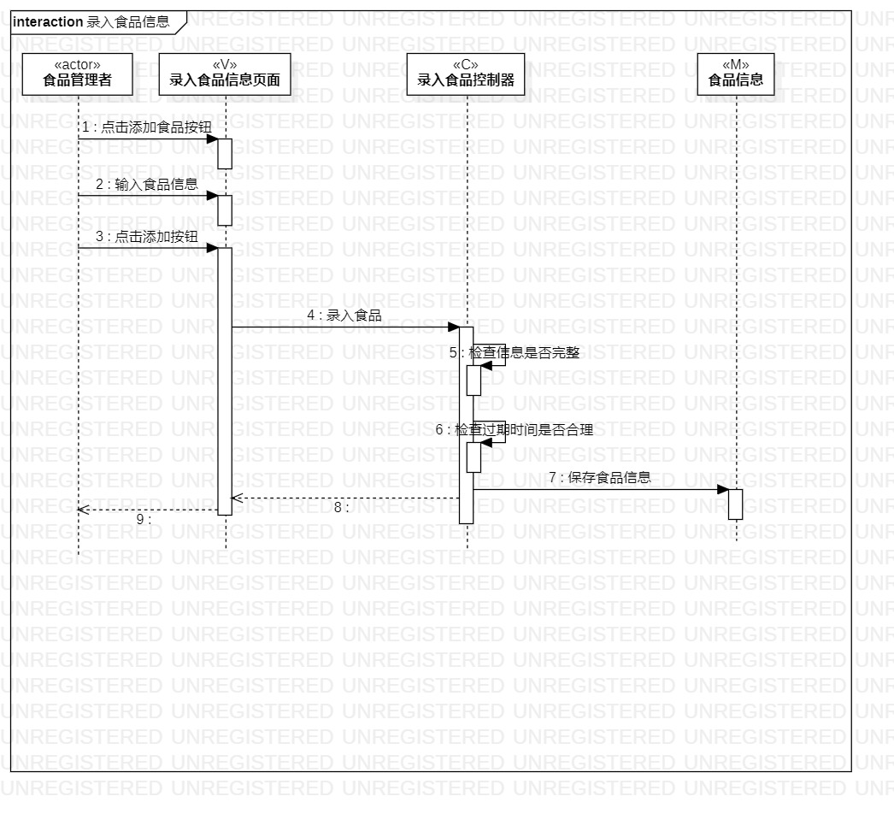
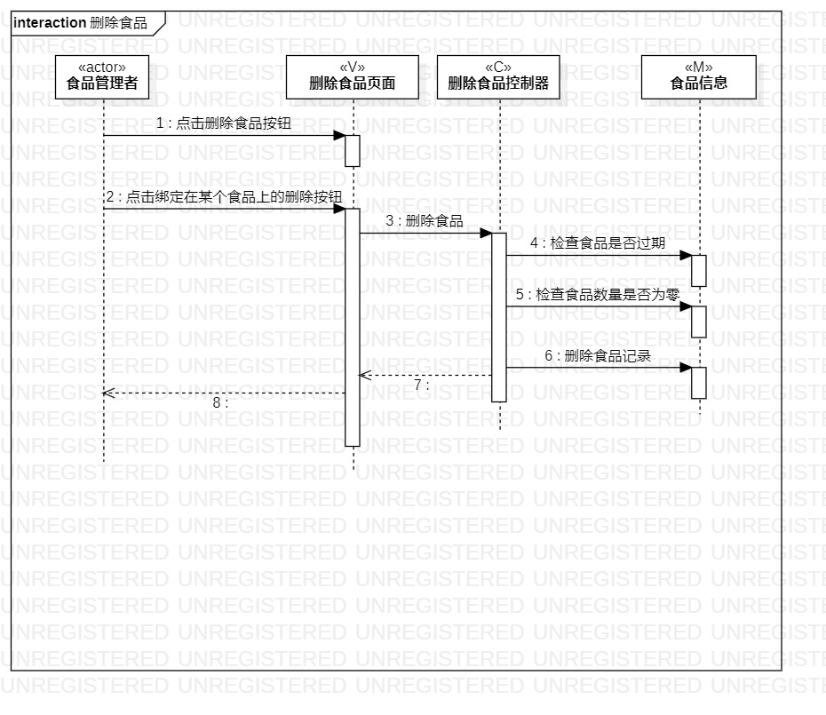

# 实验六

## 一、实验目标

1. 理解系统交互
2. 掌握UML顺序图的画法
3. 理解对象交互的定义与建模方法

## 二、实验内容

1. 观看教学视频，学习交互建模知识
2. 根据用例模型和类模型，确定功能所涉及的系统对象
3. 在顺序图上画出参与者（对象）
4. 在顺序图上画出消息（交互）

## 三、实验步骤

1. 使用哔哩哔哩网站，观看和学习交互建模知识
2. 根据用例规约图及类模型图，确定功能所涉及的系统对象
3. 创建录入食品信息顺序图 ：
	- 参与者(actor)：食品管理者
	- M：食品信息
	- V：录入食品信息页面
	- C：录入食品信息控制器
	- 消息(message)：按照录入食品信息活动图里的步骤
4. 创建删除食品顺序图：
	- 参与者(actor)：食品管理者
	- M：食品信息
	- V：删除食品页面
	- C：删除食品控制器
	- 消息(message)：按照删除食品活动图里的步骤

## 四、实验结果

  
图1. 录入食品信息顺序图

  
图2. 删除食品顺序图  

