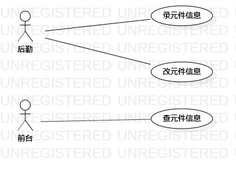

# 实验二

## 一. 实验目标

1. 学习用例建模

2. 绘制用例建模图

## 二. 实验内容

1. 确定系统的主题和功能点  

2. 在StarUML中画建模用例图

 ## 三. 实验步骤
 
1. 确定选题： 电子元件库存管理系统 

2. 确定选题的用户分类和功能  

    用户： 后勤、前台  
    功能： 录入元件信息、修改元件信息、查找元件信息 
    
3. 用例建模

  
  
  图1：电子元件库存管理系统用例图

## 表1： 录元件信息规约

用例编号  | UC01 | 备注  
-|:-|-  
用例名称  | 录元件信息  |    
前置条件  | 后勤人员登录系统   | *可选*   
基本流程  | 1. 后勤人员点击“添加”按钮  |    
~| 2. 系统显示添加界面  |   
~| 3. 后勤人员输入元件信息  |   
~| 4. 系统确认输入信息符合元件信息规格 |
~| 5. 系统匹配元件表中已有型号  |*若无相同型号*   
~| 6. 系统在元件表中添加该元件信息  |  
扩展流程  | 4.1 系统提示“输入信息有误” |
~| 5.1 系统修改元件表中该元件的数量  | *若有相同型号*  

## 表2：改元件信息规约  

用例编号  | UC02 | 备注  
-|:-|-  
用例名称  | 改元件信息  |   
前置条件  | 后勤人员登录系统    | *可选*   
基本流程  | 1. 后勤人员点击更新链接  |*用例执行成功的步骤*    
~| 2.系统显示更新界面  |  
~| 3.后勤人员输入型号  |  
~| 4.系统检查输入栏，不为空|
~| 5.系统匹配元件表，找到该型号  |   
~| 6.系统显示元件信息修改界面  |
~| 7.后勤人员编辑元件信息   |   
~| 8.系统确认输入信息与原信息不同 |
~| 9.系统更新元件表   |   
扩展流程 |4.1 系统提示“请输入查找型号”| 
~| 5.1 系统提示“库存无该型号”  |*系统匹配不到该元件型号*  
~| 8.1 系统确认输入信息与原信息相同，系统提示“数据未修改”   |   

## 表3：查元件信息规约  

用例编号  | UC03 | 备注  
-|:-|-  
用例名称  | 查元件信息  |    
前置条件  | 前台人员登录系统    | *可选*   
基本流程  | 1.前台人员点击“查找”按钮  |    
~| 2. 系统显示查找界面      |   
~| 3. 前台人员输入元件型号  |   
~| 4. 系统校验型号格式      |  
~| 5. 系统确认元件表中有该型号，显示该型号的详细信息  |
扩展流程  | 4.1 系统确认该型号不合理，显示“请输入正确型号”  |*输入的是汉字等非型号应有字符*   
~| 5.1 系统确认元件表中无该型号，显示“库存无此型号”  |*元件表中无该型号*

