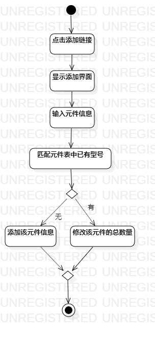
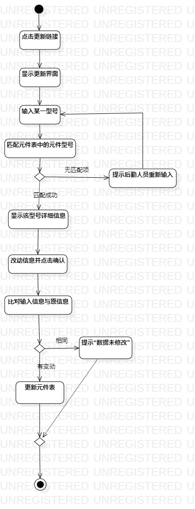
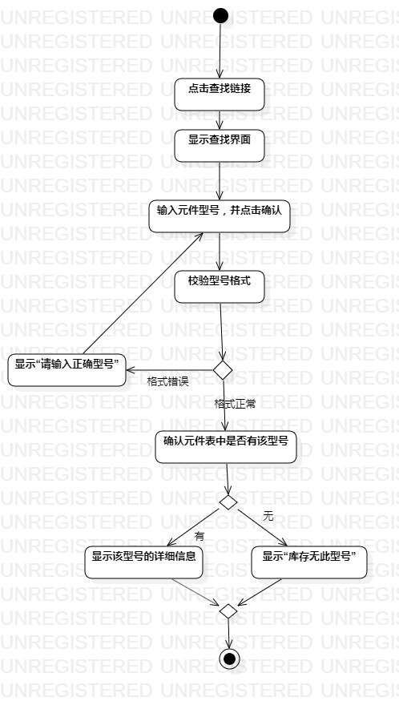

# 实验三 过程建模

## 一. 实验目标

1. 掌握过程建模方法
2. 掌握活动图的画法（Activity Diagram）
3. 完成过程建模

## 二. 实验内容

1. 了解过程建模所需组件
2. 结合实验二的用例规约完成过程建模

## 三. 实验步骤

1. 认识各个常用组件代表的意义
2. 创建活动图
3. 添加initial和final
4. 根据用例规约添加action，decision，并根据需要修改用例规约，（修改了查元件信息规约的流程4，去掉了“添加查找记录”的操作）
5. 用control flow连接各action，decision，并在decision处添加相应说明
6. 调整各组件的位置，避免control flow与action穿插，尽量美化活动图
7. 完成建模，导出活动图

 
 
图1： 录元件信息的活动图
 
 

图2： 改元件信息的活动图
 
 
 
图3： 查元件信息的活动图
