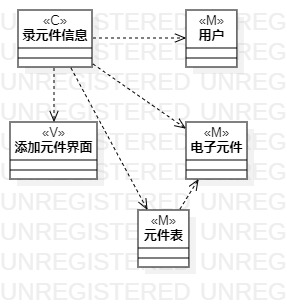
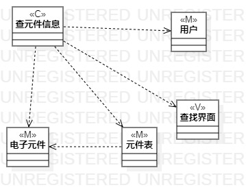

# 实验四:类建模
# 实验五:高级类建模

 ## 一、实验目标
 
 掌握类的概念和构成
 掌握类建模方法
 了解MVC设计模式
 理解类的5种关系
 掌握类之间关系的画法
 
## 二、实验内容

### 根据用例规约绘制相应的类图。

    1.录元件信息类图
    2.改元件信息类图
    3.查元件信息类图
    
## 三、实验步骤

 ### 在StarUml中创建类图
  1.录元件信息
  2.改元件信息
  3.查元件信息
 ### 从用例规约中的基本流程和扩展流程中寻找类
 ### 根据系统操作设计业务服务类
 ### 根据mvc设计模式确定类的关系
## 四、实验结果

图1 电子元件库存管理系统录元件信息类图

图2 电子元件库存管理系统改元件信息类图

图3 电子元件库存管理系统查元件信息类图
