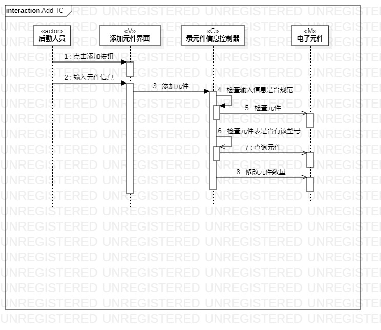
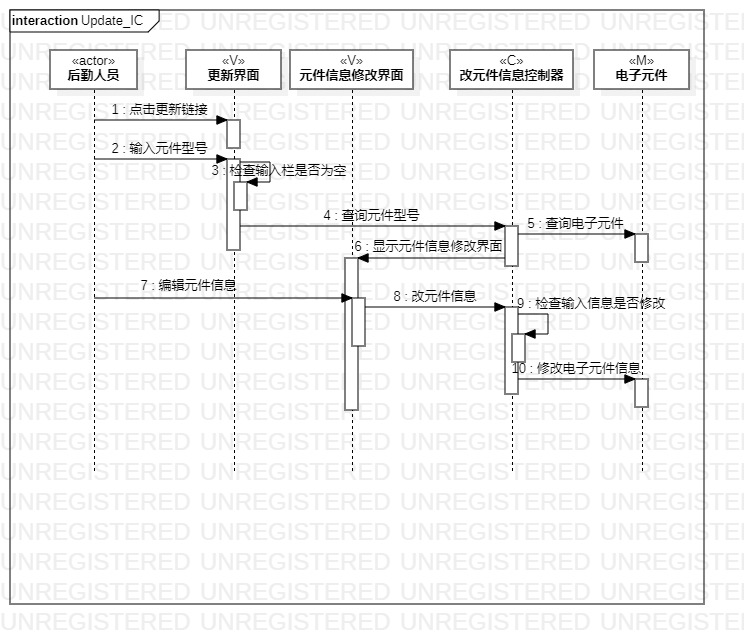
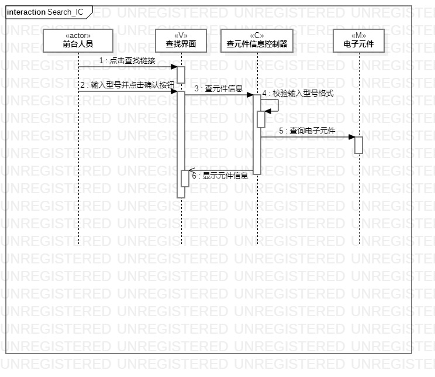

# 实验六   交互建模
## 一、实验目标

1. 掌握交互建模方法；
2. 掌握UML中交互图（Sequence Diagram）的画法；
3. 理解对象交互概念。

## 二、实验内容

1. 学习类交互图的基本概念；
2. 在bilibili观看视频学习交互建模方法；  
2. 根据活动图和类图使用StarUML画交互图。

## 三、实验步骤  

1. 根据用例模型和类模型，确定功能所涉及的系统对象；  
2. 在顺序图上画出参与者（对象）；  
3. 在顺序图上画出消息（交互）。

## 四、实验结果

  
图1 录元件信息交互图

  
图2 改元件信息交互图

  
图3 查元件信息交互图
