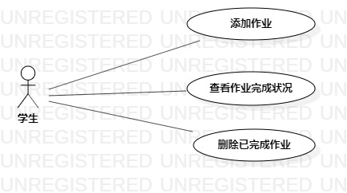

# 实验二：用例建模

## 1.实验目标

- 熟悉和掌握使用StarUML建模
- 灵活运用git

## 2.实验内容

- 细化功能需求
- 画出用例图
- 编写用例规约

## 3.实验步骤

- 在issue上新建作业管理系统

   功能1：添加作业
   
   功能2：查看作业完成情况
   
   功能3：删除已完成作业
   
- 使用StarUML为作业管理系统建模

   1、在用例图上新建一个学生Actor
   
   2、在用例图上新建添加作业，查看作业完成情况，和删除已完成作业三个Use case
   
- 将建好的用例图推送到git上

- 编写用例规约

## 4.实验结果

图1：作业管理系统的用例图

## 表1：添加作业用例规约  

用例编号  | UC01 | 备注  
-|:-|-  
用例名称  | 添加作业  |   
前置条件  |  学生已登录作业管理系统并进入系统首页    | *可选*   
后置条件  |      | *可选*   
基本流程  | 1. 学生点击作业添加按钮  |*用例执行成功的步骤*    
~| 2. 系统显示需要提交作业的基本信息；  |   
~| 3. 学生填入作业基本信息，点击提交；  |   
~| 4. 系统**检查到**作业信息,作业基本信息填写规范；  | 
~| 5. 系统**查询到**用户信息；  | 
~| 6. 系统登记作业基本信息，系统显示添加作业成功。  |  
扩展流程  | 4.1 系统**查询到**作业信息，**提示“该作业信息填写不规范”**；  |*用例执行失败*  
~| 5.1 系统**查询不到**用户信息，**提示“该用户不存在”**；  |

## 表2：查看作业完成情况用例规约  

用例编号  | UC02 | 备注  
-|:-|-  
用例名称  | 查看作业完成情况  |   
前置条件  | 学生已登录作业管理系统并进入系统首页   | *可选*   
后置条件  |      | *可选*   
基本流程  | 1. 系统首页显示每个作业所处状态；  |*用例执行成功的步骤*    
~| 2. 学生点击作业；  | 
~| 3. 系统**查询到**用户信息；  |
~| 4. 系统**查询到**作业信息；  |    
~| 5. 系统进入作业完成状况页面。  |  
扩展流程  | 3.1 系统**查询不到**用户信息，**提示“该用户不存在”**；  |
~|  5.1 系统查询到作业库为空，**提示“作业库没有作业”**     |*用例执行失败*    

 

## 表3：删除已完成作业用例规约  

用例编号  | UC03 | 备注  
-|:-|-  
用例名称  | 删除已完成作业  |   
前置条件  |   学生已登录作业管理系统并进入系统首页   | *可选*   
后置条件  |      | *可选*   
基本流程  | 1. 学生点击状态为已完成作业；  |*用例执行成功的步骤*    
~| 2. 系统显示作业的完成情况；  |   
~| 3. 学生点击删除按钮；  |   
~| 4. 系统**查询到**作业信息，作业为已完成状态；  |  
~| 5. 系统**查询到**用户信息；  | 
~| 6. 系统删除作业。  |  
扩展流程  | 4.1 系统查询到该作业未完成，**提示“该作业还未完成”**；  |*用例执行失败*    
~| 4.2 系统检查不到该作业，**提示“该作业不存在”**。  |  
~| 5.1 系统**查询不到**用户信息，**提示“该用户不存在”**；  |
