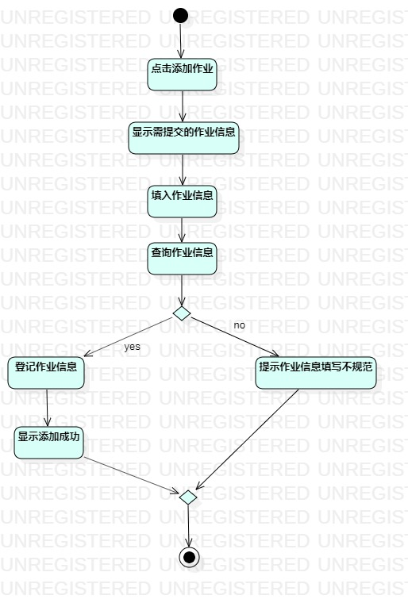
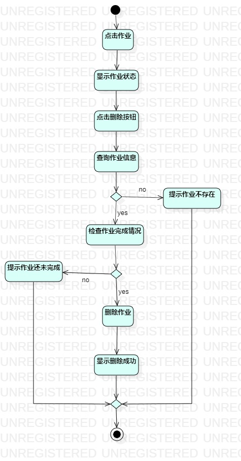
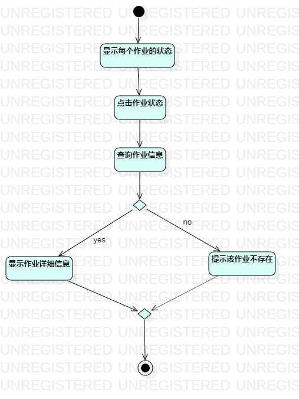

# 实验三：过程建模  

## 一、实验目标

#### 1. 掌握过程建模的方法；
#### 2. 掌握活动图的画法 。

## 二、画图要点  

#### 1.把基本流程和扩展流程的动作画为操作（Action）；  
#### 2.在出现分支的操作之后使用决策（Decision）节点。  

## 三、 实验步骤

#### 1. 为作业管理系统的3个功能创建三个活动图
#### 2. 添加活动图的开始和结束
#### 3. 按照三个功能的用例规约添加动作
#### 4. 扩展流程添加decision
#### 5. 将所有动作连接起来

## 四、 实验结果  

图1：添加作业的活动图

图2：删除已完成作业的活动图

图3：查看作业完成情况的活动图

## 五、实验总结
1. 用Markdown编写实验报告能掌握文档编辑格式，使自己更加注重文档的格式
2. 本次实验画用例活动图更好地了解了系统的功能
3. 提高了画图能力

## 六、实验调试
1. 
what:  
画图的步骤陌生，只能跟着视频边看边画

why:  
在这之前从未画过这种图，学习能力不强

how:  
将视频多看两遍，尝试自己画，再看视频修改活动图

2. 
what:  
混淆成语意思

why:  
用词随便，没有及时查证

how:  
查证意思，及时更正
  
 
