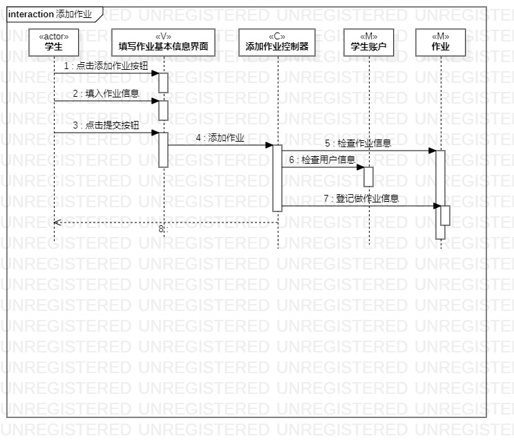
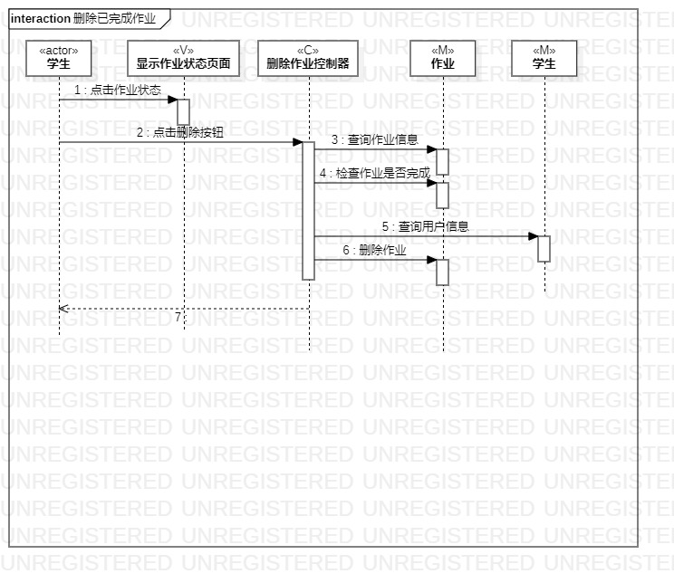
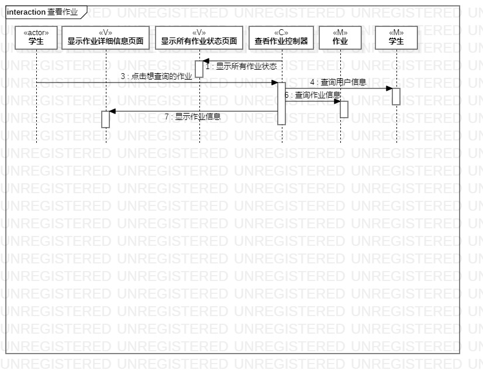

# 实验六交互建模

## 实验目标

1. 理解系统交互；
2. 掌握UML顺序图的画法；
3. 掌握对象交互的定义与建模的方法。

## 实验内容

1. 根据用例模型和类模型，确定功所涉及的系统对象；
2. 在顺序图上画出参与者；
3. 在顺序图上画出消息（交互）。

## 实验步骤

1. 新建顺序图由用例规约决定actor；
2. 从每个功能的类图中确定对象，在类图中有多少个类就有多少个对象；
3. 在根据用例活动图的每个操作画出对象之间的交互即消息；
4. 再回去看用例规约上的流程是否符合逻辑；
5. 最后重新调整顺序图。

## 实验结果

图1：添加作业顺序图

图2：删除已完成作业顺序图

图3：查看作业顺序图

## 实验总结

    这次实验让我让把用例规约，活动图，类图和顺序图的所有知识连贯起来，每一次实验都是为了下一次实验做好的准备。
    如果在写用例规约时，对自己的系统没有清晰的思路和目的就会导致在后面的活动图和类图上没有方向不知道如何下手，
    最后在实验六的顺序图上就没办法将人与系统的交互画出来。在这次实验中，我也再次理清了自己对这个系统的思路，重新
    修改了用例规约、类图和活动图。
 
