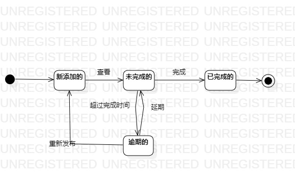

# 实验七 状态建模

## 实验目标
- 掌握对象状态建模。

## 实验内容
- 掌握状态图的画图要素；
- 结合系统的活动图，顺序图，类图画出最重要对象的状态图。

## 实验步骤
1. 找对象----在系统的活动图、类图、顺序图中寻找最重要的对象作为状态图的对象；
2. 找状态----寻找各个功能中对象可能处于的状态，并合并相同状态；
3. 找转变条件----寻找状态与状态之间的操作；
4. 用形容词在圆角矩形内写明状态；
5. 在可转变的状态之间用箭头连接起来；
6. 在箭头上表明转变条件。

## 实验要点
1. 寻找一个关键对象；
2. 设计对象的关键状态；
- 对象的状态是：对象所表示的数据。如果数据发生变化，状态就发生变化；
- 描述状态：形容词；
3. 设计状态之间的转变条件。

## 实验结果

图1：作业的状态图
