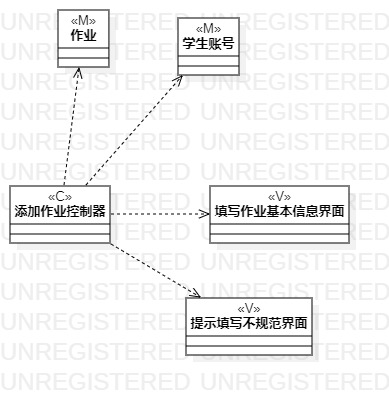
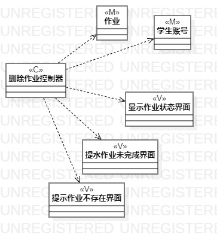

# 实验四&五：类建模  

## 一、实验目标

#### 1. 掌握类建模的方法；
#### 2. 掌握类图的画法 。

## 二、画图要点  

#### 1.按照MVC框架用Model表示类，用View表示界面，用Control表示控制器；  
#### 2.用从依赖到继承不同关联程度的线将M，V，C,连接起来。

## 三、 实验步骤

#### 1. 从每个功能的用例规约上抽取Model,View,Control；
#### 2. 添加每个类图的Model
#### 3. 添加每个功能的View
#### 4. 添加每个功能的Control
#### 5. 用依赖关系的线把类和界面都连接到控制器上
#### 6. 如果有包含关系则用关联度处于中间的线连接

## 四、 实验结果  

图1：添加作业的类图

图2：删除已完成作业的类图

图3：查看作业完成情况的类图

## 五、实验总结
1. 用Markdown编写实验报告能掌握文档编辑格式，使自己更加注重文档的格式
2. 通过本次画功能的类图，我重新温习了MVC框架
3. 虽然之前学过类的相关知识，但是还是对MVC框架相对陌生

## 六、实验调试
1. 
what:  
对老师视频的依赖性较强

why:  
本次实验老师的讲解比之前的要简略些，我看得有点迷

how:  
之前都是一步步跟着老师的步伐走的，自己用心不够

2. 
what:  
对StartUml的工具栏运用不熟

why:  
画图次数太少

 
