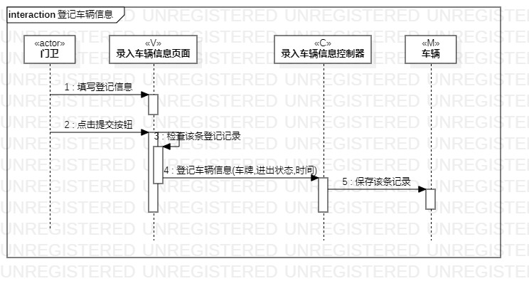
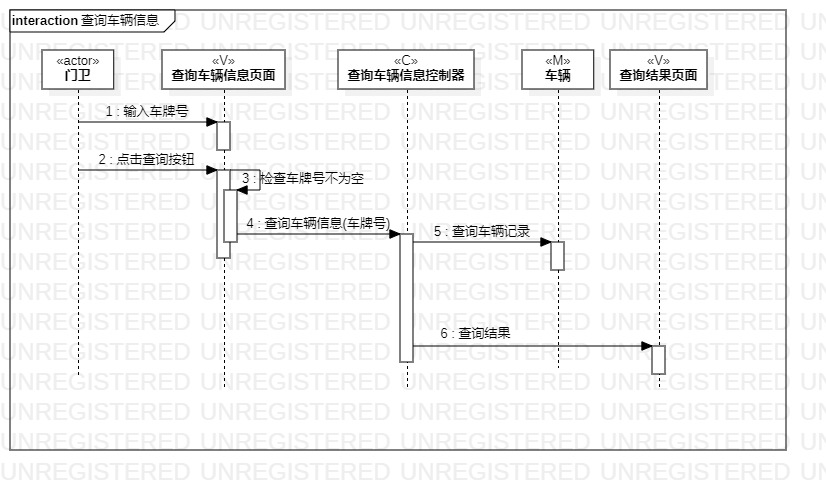

# 实验六：交互建模
## 一、实验目标
1. 理解系统交互
2. 掌握UML顺序图的画法
3. 掌握对象交互的定义与建模方法
## 二、实验内容
1. 根据用例模型和类模型，确定功能所涉及的系统对象
2. 在顺序图上画出参与者（对象）
3. 在顺序图上画出消息（交互）
## 三、实验步骤
1. 在staruml上画登记车辆信息实例的顺序图
- 根据实验4类图画出参与者
- 根据实验3的活动图确定参与者的交互关系，画出参与者之间的消息
2. 在staruml上画查询车辆信息实例的顺序图(同1)
## 四、实验结果  
  
图1：登记车辆信息用例顺序图

  
图2：查询车辆信息用例顺序图
