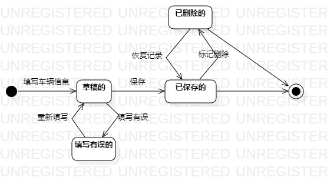

# 实验七：状态建模

 ## 一、实验目标

 1. 掌握对象状态建模（Statechart）

 ## 二、实验内容

 1. 画出系统关键对象的状态图;

 ## 三、实验步骤

 1. 选取系统关键对象
 2. 通过给对象加上属性来表达状态（使用形容词来表示状态）
 3. 找出状态之间的转变条件  
 -在系统存储空间的原始的车辆信息记录可以标记为删除状态，被标记的记录被移到删除区，
 在删除区的记录在没有被系统彻底删除(当系统存储空间快满或预设时间到时彻底删除)前，可以被恢复成之前的状态
 4. 在StartUML上画状态图
 ## 四、实验结果

 
