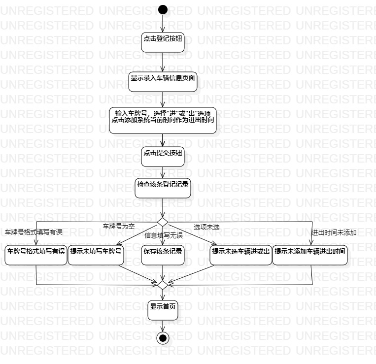
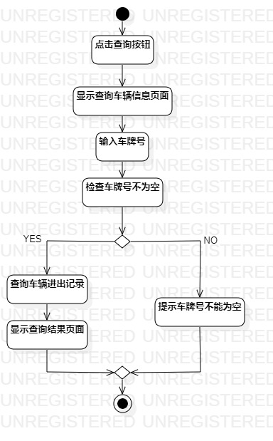

# 实验三：过程建模
## 一、实验目标

1. 掌握过程建模方法；
2. 掌握活动图的画法。（Activity Diagram）

## 二、实验内容

1. 学习活动图画法，
2. 根据用例规约用StarUML画活动图

## 三、实验步骤

1. 用StarUML画登记车辆信息的活动图

  - 添加开始initial和结束final
  - 根据用例规约确定相应的action
  - 如果有扩展流程，添加decision
  - 添加一个Merge将分支汇总
  - 用control flow连接各个部分
  - 最后调整各部分位置尽可能简洁美观
  
2. 用StarUML画查询车辆信息的活动图(同1)

## 四、实验结果

  
图1：登记车辆信息活动图

  
图2：查询车辆信息活动图
