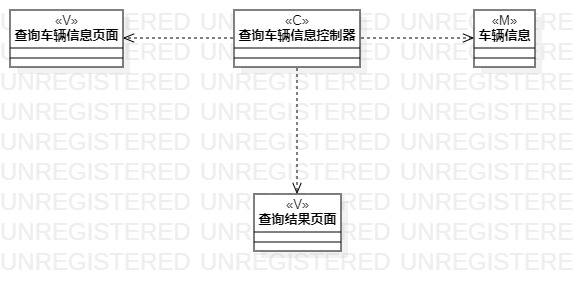

# 实验四、五：类建模

## 一、实验目标

1. 掌握类建模方法
2. 了解MVC模式
3. 掌握类图画法(class diagram)
4. 理解UML类图的5种关系
5. 掌握类之间的关系画法

## 二、实验内容

1. 学习类图概念
2. 学习类图画法
3. 画用例类图

## 三、实验步骤
1. 学习笔记：  
- 类：属性与操作  
（1）属性描述对象的状态  
（2）操作描述对象的行为
- MVC设计模式  
（1）Model模型：存取数据的实体对象；  
（2）View视图：数据可视化；  
（3）Controller控制器：作用于模型与视图，它使模型与视图分开；    
- 类图的5种关系（由弱到强）(一般关系松散的比较好，因为它的耦合度比较低，容易修改)    
（1）依赖（Dependency）：一种使用关系；  
（2）关联(Association)：一种拥有的关，它使一个类知道另一个类的属性和方法；  
（3）聚合(Aggregation)：整体与部分的关系，部分可离开整体单独存在；  
（4）组合(Composition)：整体与部分的关系，部分不能离开整体单独存在；  
（5）继承(Inheritance)：一种继承关系，表示父类与子类的关系；   

  
2. 根据MVC模式观察用例的模型（数据）、视图、控制器（系统）
3. 用StarUML画查询车辆信息用例的类图
 - 按模型添加Class
 - 添加控制器Class
 - 添加界面Class
 - 按MVC模式建立Dependency
4. 用StarUML画录入车辆信息用例的类图（同3）
## 四、实验结果

  
图1：查询车辆信息用例的类图  

  
图2：录入车辆信息用例的类图  
