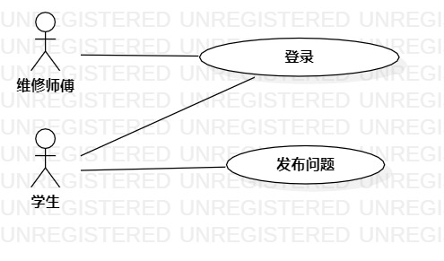

# 实验二：用例建模

## 一.实验目标

1.1 熟悉使用StarUML建模

1.2 熟悉使用git

## 二.实验内容
2.1 确定选题和功能

2.2 创建用例图

2.3 编写用例规约

## 三.实验步骤

3.1 在issue里提交选题和功能介绍

（1） 题目为#649 宿舍呼叫维修系统

（2） 功能为发布问题和发表评论

3.2 在StarUML上创建用例图

（1） 确定参与者为学生

（2） 添加用例为发布问题和发表评论

（3） 建立参与者与用例之间的联系

3.3 将用例图推送到git上

3.4 编写用例规约

（1） 编写发布问题用例规约

（2） 编写发表评论用例规约

## 四.实验结果

 

图1：宿舍呼叫维修系统的用例图

## 表1：发布问题用例规约

用例编号  | UC01 | 备注  
 -|:-|-  
 用例名称  | 发布问题  |   
 前置条件  |  学生已进入发布问题页面    | *可选*   
 后置条件  |     | *可选*   
 基本流程  | 1. 学生输入内容，点击发布按钮；  |*用例执行成功的步骤*    
 ~| 2. 系统检测到内容不为空，保存内容后，提示“问题发布成功”；  |   
 ~| 3. 系统跳转到发布问题页面。  |   
 扩展流程  | 4.1 系统检测到内容为空，提示“内容不为空”  |*用例执行失败*    
 
## 表2：发表评论用例规约
 
 用例编号  | UC02 | 备注  
 -|:-|-  
 用例名称  | 发表评论  |   
 前置条件  | 学生已进入发表评论界面   | *可选*   
 后置条件  |      | *可选*   
 基本流程  | 1. 学生输入内容，点击确定按钮；  |*用例执行成功的步骤*    
 ~| 2. 系统检测到内容不为空，保存内容，提示“评论成功”；  |   
 ~| 3. 系统跳转到发表评论界面。  |    
 扩展流程  |  4.1 系统检测到内容为空，提示“没有发表评论”，跳转到问题评论界面   |*用例执行失败*    
