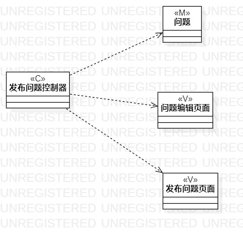
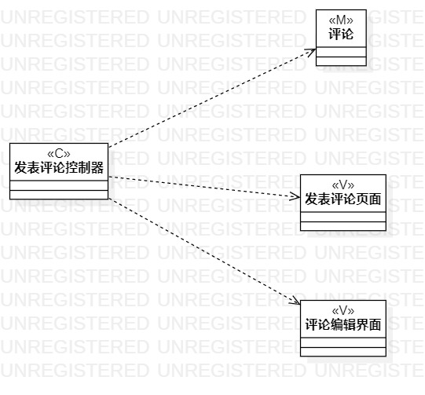

# 实验四：类建模

 ## 一、实验目标

 1. 掌握类建模方法
 2. 了解MVC或熟悉的设计模式
 3. 掌握类图的画法（Class Diagram）
 4. 理解类的5种关系

 ## 二、实验内容

 1. 根据实验二中的用例规约创建类图

 ## 三、实验步骤

 1. 观看老师的指导视频
 2. 修改之前实验中不足的地方
 3. 在StarUML中创建发布问题和发表评论的两个类图
 4. 将画好的两个类图上传到git上
 5. 编写实验报告

 ## 四、实验结果

 
 
 图1：发布问题的类图

 
 
 图2：发表评论的类图
