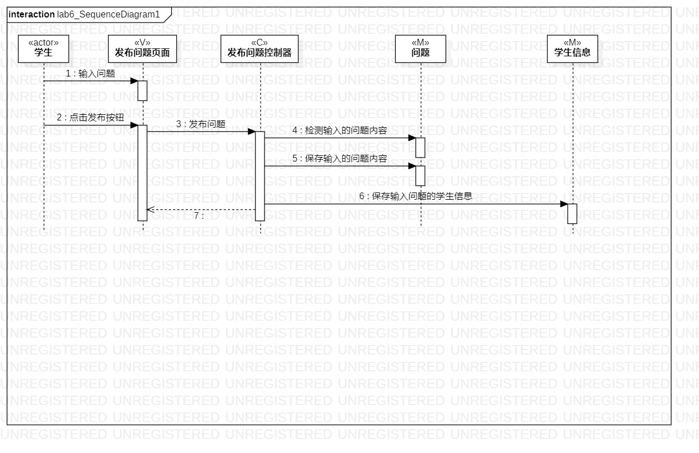
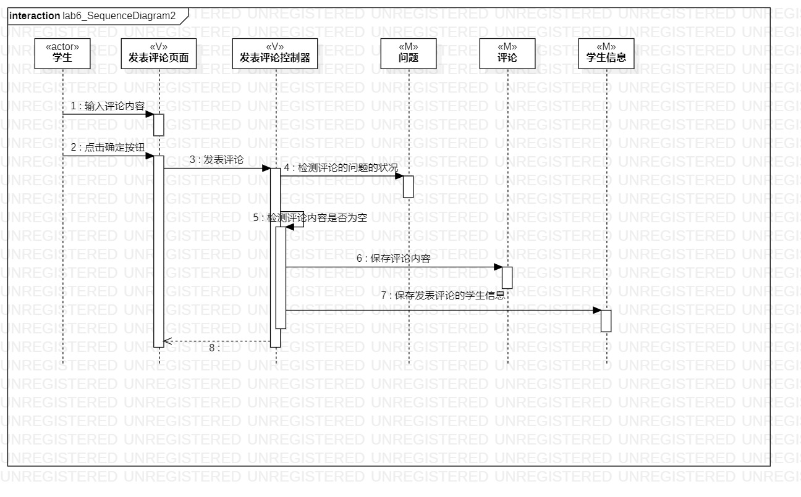

# 实验六：交互建模

 ## 一、实验目标

 1. 理解系统交互
 2. 掌握UML顺序图的画法
 3. 掌握对象交互的定义与建模方法

 ## 二、实验内容

 1. 根据用例模型和类模型，确定功能所涉及的系统对象
 2. 在顺序图上画出参与者（对象）
 3. 在顺序图上画出消息（交互）

 ## 三、实验步骤

 1. 观看老师发布的指导视频
 2. 修改完善用例规约和类图
 3. 根据用例规约和类图，画出发布问题和发表评论的顺序图
 4. 将画好的两张顺序图提交到git上
 5. 提交实验报告

 ## 四、实验结果

 
 
 图1.发布问题的顺序图

 
 
 图2.发表评论的顺序图

