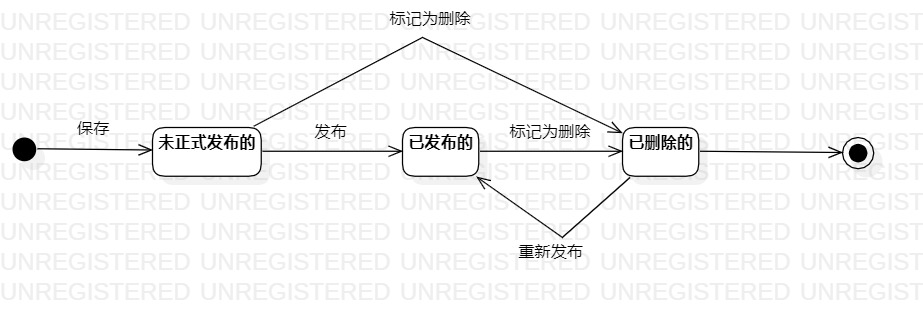

# 实验七：状态建模

 ## 一、实验目标

 1. 理解何为对象的状态；
 2. 掌握状态建模方法；
 3. 掌握状态图的画法（Statechart Diagram）。

 ## 二、实验内容

 1. 学习对象的状态的概念；
 2. 学习状态图的画法；
 3. 找出自己系统中的一个关键对象，绘制该对象的状态图。

 ## 三、实验步骤

 1. 观看老师发布的指导视频，明白作业要求；
 2. 在StarUML中绘制问题的状态图；
 3. 将绘制的问题状态图保存到git上；
 4. 编写实验报告。

 ## 实验结果

    
 图1：问题的状态图
