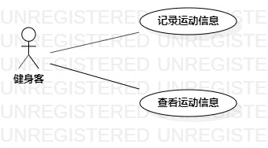

# 实验二

## 一、实验目标

1. 熟悉GitHub操作
2. 创建并完善选题
3. 熟悉StarUML
4. 了解并掌握用例图的画法
5. 了解并掌握用例规约

## 二、实验内容

1. 使用Markdown完善实验一报告
2. UML建模选题
3. 在StarUML中画建模用例图
4. 编写用例规约
5. 使用Markdown编写实验二报告

## 三、实验步骤

1. 确定选题：运动打卡系统
2. 确定用户：健身客
3. 确定功能：
(1) 记录运动信息：健身客可以填写信息，然后打卡
(2) 删除运动信息：健身客可以选择打卡日期，然后删除所选择打卡日期的运动信息并标记为“未打卡”
4. 绘制用例图
5. 编写用例规约（记录运动信息用例规约、删除运动信息用例规约）

## 四、实验结果

图1：运动打卡系统用例图

## 表1：记录运动信息用例规约  

用例编号  | UC01 | 备注  
-|:-|-  
用例名称  | 记录运动信息 |   
前置条件  | 健身客已经登录 | *可选*   
后置条件  | 健身客进入打卡成功页面 | *可选*   
基本流程  | 1. 健身客点击记录信息按钮 |*用例执行成功的步骤*    
~| 2. 系统显示运动信息填写页面 |   
~| 3. 健身客输入运动信息，点击打卡按钮 |   
~| 4. 系统查询健身客信息，检查健身客当天未打卡，保存健身客运动信息 |   
~| 5. 系统显示打卡成功页面 |  
扩展流程  | 4.1 系统检查发现健身客当天已经打卡，提示“今天已经打卡” |*用例执行失败*    

## 表2：删除运动信息用例规约  

用例编号  | UC02 | 备注  
-|:-|-  
用例名称  | 删除运动信息 |   
前置条件  | 健身客已经登录 | *可选*   
后置条件  | 健身客进入删除成功页面 | *可选*   
基本流程  | 1. 健身客点击删除信息按钮 |*用例执行成功的步骤*    
~| 2. 系统显示打卡日期选择页面 |   
~| 3. 健身客选择需要删除的打卡日期，点击删除按钮 |   
~| 4. 系统查询健身客信息，检查所选打卡日期已打卡，删除所选打卡日期的运动信息并标记为“未打卡” |   
~| 5. 系统显示删除成功页面 |  
扩展流程  | 4.1 系统检查发现所选打卡日期未打卡，提示“所选日期未打卡，删除失败” |*用例执行失败*    
