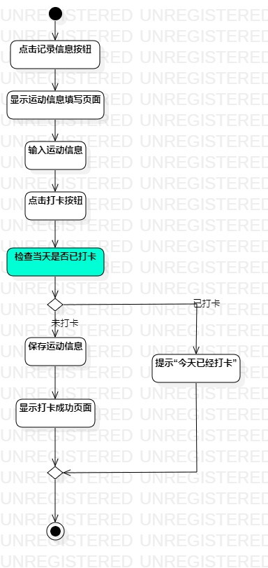
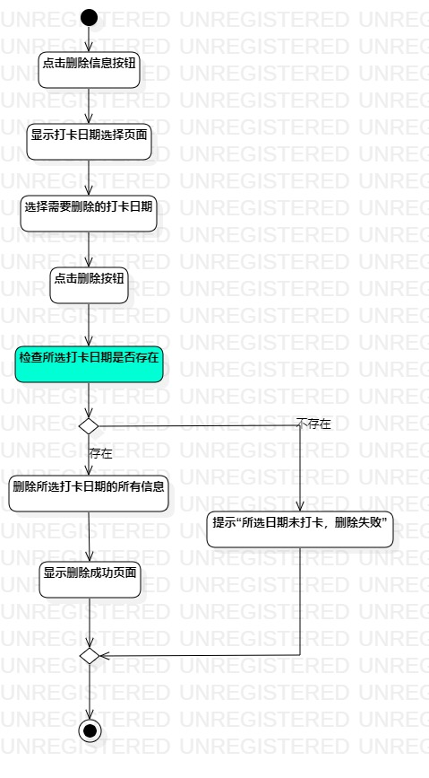

# 实验三

## 一、实验目标

1.掌握过程建模方法

2.掌握活动图的画法

## 二、实验内容

1.阅读实验文档以及观看实验相关视频

2.根据实验二用例规约用StarUML画活动图

3.编写实验报告

## 三、实验步骤

1.使用StarUML新建2个ActivityDiagram：

(1)记录运动信息的活动图

(2)删除运动信息的活动图

2.根据实验二用例规约绘制活动图：

(1)确定Action

(2)确定决策路径发生的条件

## 四、实验结果

图1：记录运动信息的活动图

图2：删除运动信息的活动图
