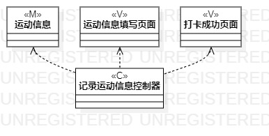
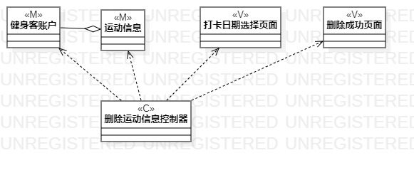

# 实验四、五

## 一、实验目标

#### 1.掌握类建模方法
#### 2.了解MVC设计模式
#### 3.理解类的5种关系
#### 4.掌握类图的画法（Class Diagram）

## 二、实验内容

#### 1.基于MVB模式设计类
#### 2.设计类的关系
#### 3.画出类图

## 三、实验步骤

#### 1.了解学习类建模知识
#### 2.在用例规约中寻找并设计类
#### 3.根据“记录运动信息用例规约”设计类：
- M：健身客类、运动信息类
- V：运动信息填写页面、打卡成功页面
- C：记录运动信息控制器

#### 4.根据“删除运动信息用例规约”设计类：
- M：健身客类、运动信息类
- V：打卡日期选择页面、删除成功页面
- C：删除运动信息控制器

## 四、实验结果

图1：记录运动信息的类图

图2：删除运动信息的类图
