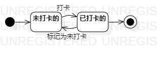

# 实验七

## 一、实验目标

#### 1.掌握对象状态建模方法
#### 2.画出状态图

## 二、实验内容

#### 1.根据用例图、用例规约、活动图等，确定关键对象
#### 2.确定对象的状态和状态间转换的条件
#### 3.画出状态图

## 三、实验步骤

#### 1.新建状态图，确定状态图对象；
#### 2.确定对象的所有状态；
#### 3.确定对象状态转变的条件；
#### 4.绘制状态图

## 四、实验结果

图1：健身客的状态图
