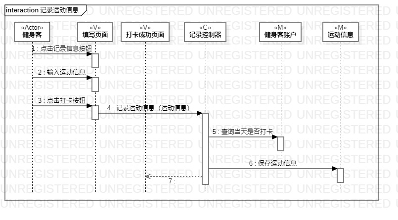
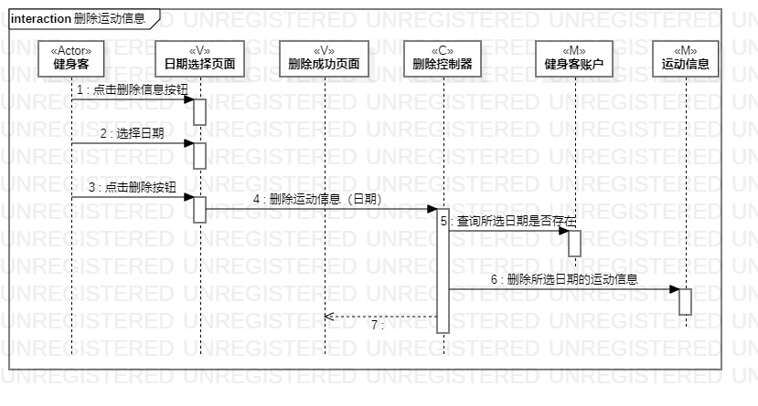

# 实验六

## 一、实验目标

#### 1.理解系统交互
#### 2.掌握UML顺序图的画法
#### 3.掌握对象交互的定义与建模方法

## 二、实验内容

#### 1.根据用例模型和类模型，确定功能所涉及的系统对象
#### 2.在顺序图上画出参与者（对象）
#### 3.在顺序图上画出消息（交互）

## 三、实验步骤

#### 1.创建记录运动信息的顺序图
- 从用例图找参与者（Actor）:健身客
- 从类图找到5个参与者（总共6个参与者）
- 从活动图找到操作步骤，画出参与者之间的消息

#### 2.创建删除运动信息的顺序图
- 从用例图找参与者（Actor）：健身客
- 从类图找到5个参与者（总共6个参与者）
- 从活动图找到操作步骤，画出参与者之间的消息

## 四、实验结果

图1：记录运动信息的顺序图

图2：删除运动信息的顺序图
