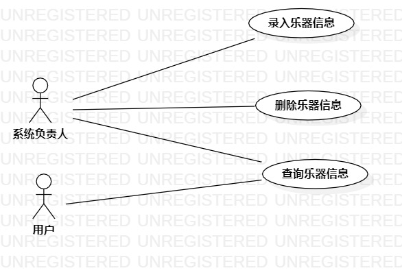

# 实验二 用例建模

## 一、实验目标

1. 学会使用Markdown编写实验报告
2. 掌握用例的概念和用例建模

## 二、实验内容

1. 提交个人选题到Issues
2. 用Markdown完成实验报告
3. 用StartUML完成用例建模

## 三、实验步骤

1. 在issues上提交“乐器查询系统”选题与相关功能：

- 录入乐器
- 查询乐器
- 删除乐器

2. 根据选题和所选功能在StarUML上画出用例图：

- 创建“系统负责人”和“用户”两个参与者
- 创建三个用例
- 建立关系Association

3. 编写用例规约
4. 将用例图和实验报告提交

## 四、实验结果

图1：“乐器信息查询系统”用例图

## 表1：录入乐器用例规约

| 用例编号 | UC01                            |
| ---- | ------------------------------- |
| 用例名称 | 录入乐器                            |
| 前置条件 | 系统负责人进入录入界面                     |
| 基本流程 | 1.系统负责人点击录入按钮；                  |
| ~    | 2.系统负责人录入乐器；                    |
| ~    | 3.系统负责人点击确定；                    |
| ~    | 4.系统检查录入的乐器；                    |
| ~    | 5.系统保存乐器，并提示“**录入成功**”。         |
| 扩展流程 | 4.1系统发现录入乐器有重复，并提示“**请勿重复录入**”。 |

## 表2：查询乐器用例规约

| 用例编号 | UC02                               |
| ---- | :--------------------------------- |
| 用例名称 | 查询乐器                               |
| 前置条件 | 用户进入乐器查询界面                         |
| 基本流程 | 1. 用户点击搜索框；                        |
| ~    | 2. 用户输入乐器名称；                       |
| ~    | 3.用户点击搜索；                          |
| ~    | 4.系统检查输入的乐器名称；                     |
| ~    | 5.系统显示乐器；                          |
| 扩展流程 | 4.1系统检查输入的乐器名称为空，提示“**乐器名称不能为空**”； |
## 表3：删除乐器用例规约

| 用例编号 | UC03                             |
| ---- | -------------------------------- |
| 用例名称 | 删除乐器                             |
| 前置条件 | 系统负责人进入删除乐器界面                    |
| 基本流程 | 1.系统负责人选中想要删除的乐器；                |
| ~    | 2.系统负责人点击删除；                     |
| ~    | 3.系统**跳出**提出框，提示“**是否删除？**”；     |
| ~    | 4.系统负责人点击确定；                     |
| ~    | 5.系统检查乐器占用情况；                    |
| ~    | 6.系统删除该乐器，并提示“**删除成功**”；         |
| 扩展流程 | 5.1 系统删除失败，提示“**乐器被占用，请稍后再删除**”； |