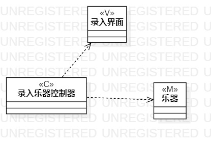
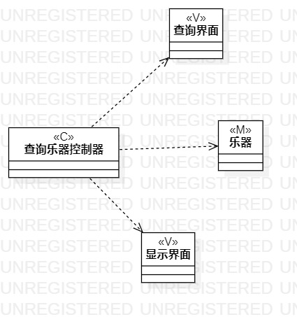
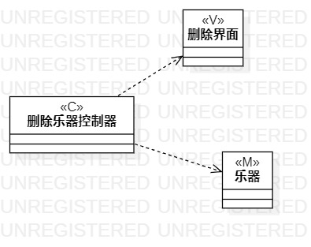

# 实验四五 类建模

## 一、实验目标

1. 掌握类建模方法；
2. 了解MVC设计模式；

3.掌握类图的画法。

## 二、实验内容

1. 基于MVC模式设计类；
2. 设计类的关系；
3. 画出类图。

## 三、实验步骤

1. 确定设计模式,选择使用MVC模式;
2. 查看用例规约，从中找出模型、视图和控制器；
3. 绘制类图，画出模型、视图和控制器；
4. 确定类间之间的关系，连线；
5. 根据实际,检查修改用例规约和类图。

## 四、实验结果

​									图一：录入乐器类图

​									图二：查询乐器类图

​										图三：删除乐器类图